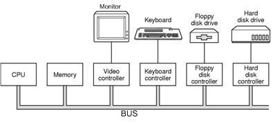
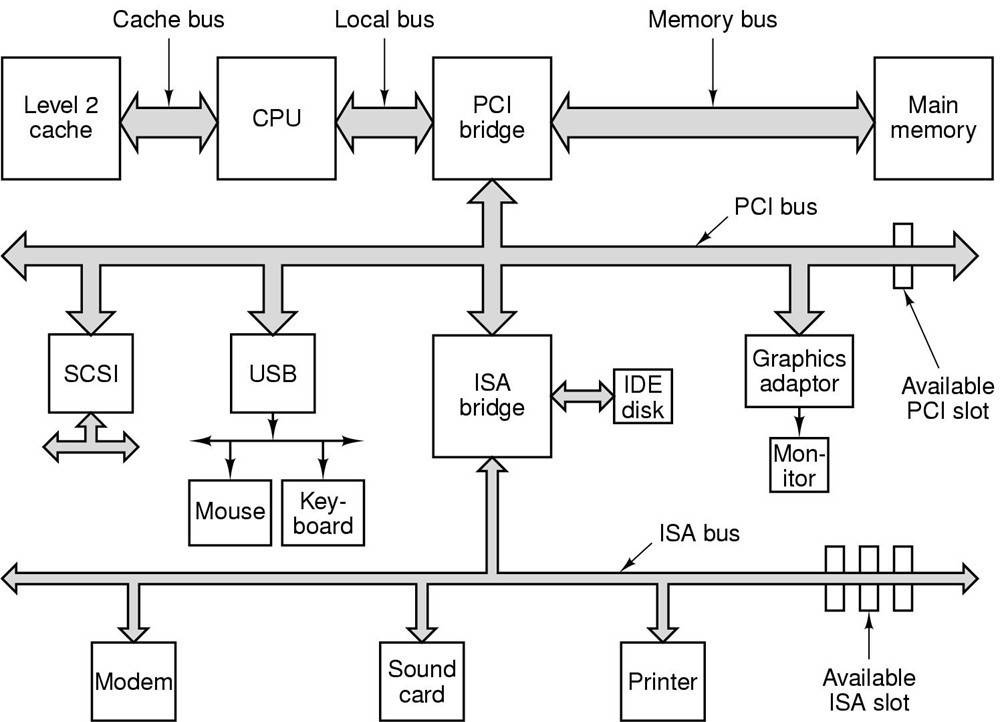

# 1.2 万变不离其宗

计算机是个非常广泛的概念，大到占用数层楼的用于科学计算的超级计算机，小到手机上的嵌入式芯片都可以被称为计算机。虽然它们的外形、结构和性能都千差万别，但至少它们都有“计算”这个概念。在本书里面，我们将计算机的范围限定在最为流行、使用最广泛的PC机，更具体地讲是采用兼容x86指令集的32位CPU的个人计算机。原因很简单：因为笔者手上目前只有这种类型的计算机可供操作和实验，不过相信90%以上的读者也是，所以在这一点上我们很快能达成共识。其实选择具体哪种平台并不是最关键的，虽然各种平台的软硬件差别很多，但是本质上它们的基本概念和工作原理都是一样的，只要我们能够掌握一种平台上的技术，那么其他的平台都是大同小异的，很轻松地可以举一反三。所以我们相信，只有你能够深刻地理解x86平台下的系统软件背后的机理，当有一天你需要在MIPS指令集的嵌入式平台上做开发，或者需要为64位的Windows或Linux开发应用程序的时候，你很快就能找到它们之间的相通之处。

撇开计算机硬件中纷繁复杂的各种设备、芯片及外围接口等，站在软件开发者的角度看，我们只须抓住硬件的几个关键部件。对于系统程序开发者来说，计算机多如牛毛的硬件设备中，有三个部件最为关键，它们分别是中央处理器CPU、内存和I/O控制芯片，这三个部件几乎就是计算机的核心了；对于普通应用程序开发者来说，他们似乎除了要关心CPU以外，其他的硬件细节基本不用关心，对于一些高级平台的开发者来说（如Java、.NET或脚本语言开发者），连CPU都不需要关心，因为这些平台为它们提供了一个通用的抽象的计算机，他们只要关心这个抽象的计算机就可以了。

早期的计算机没有很复杂的图形功能，CPU的核心频率也不高，跟内存的频率一样，它们都是直接连接在同一个总线（Bus）上的。由于I/O设备诸如显示设备、键盘、we软盘和磁盘等速度与CPU和内存相比还是慢很多，当时也没有复杂的图形设备，显示设备大多是只能输出字符的终端。为了协调I/O设备与总线之间的速度，也为了能够让CPU能够和I/O设备进行通信，一般每个设备都会有一个相应的I/O控制器。早期的计算机硬件结构如图1-1所示。

\
图1-1 早期的计算机硬件结构

后来由于CPU核心频率的提升，导致内存跟不上CPU的速度，于是产生了与内存频率一致的系统总线，而CPU采用倍频的方式与系统总线进行通信。接着随着图形化的操作系统普及，特别是3D游戏和多媒体的发展，使得图形芯片需要跟CPU和内存之间大量交换数据，慢速的I/O总线已经无法满足图形设备的巨大需求。为了协调CPU、内存和高速的图形设备，人们专门设计了一个高速的北桥芯片，以便它们之间能够高速地交换数据。

由于北桥运行的速度非常高，所有相对低速的设备如果全都直接连接在北桥上，北桥既须处理高速设备，又须处理低速设备，设计就会十分复杂。于是人们又设计了专门处理低速设备的南桥（Southbridge）芯片，磁盘、USB、键盘、鼠标等设备都连接在南桥上，由南桥将它们汇总后连接到北桥上。20世纪90年代的PC机在系统总线上采用的是PCI结构，而在低速设备上采用的ISA总线，采用PCI/ISA及南北桥设计的硬件构架如图1-2所示。

\
图1-2 硬件结构框架

位于中间是连接所有高速芯片的北桥（Northbridge，PCI Bridge），它就像人的心脏，连接并驱动身体的各个部位；它的左边是CPU，负责所有的控制和运算，就像人的大脑。北桥还连接着几个高速部件，包括左边的内存和下面的PCI总线。

PCI的速度最高为133MHz，它还是不能满足人们的需求，于是人们又发明了AGP、PCI Express等诸多总线结构和相应控制芯片。虽然硬件结构看似越来越复杂，但实际上它还是没有脱离最初的CPU、内存，以及I/O的基本结构。我们从程序开发的角度看待硬件时可以简单地将它看成最初的硬件模型。

## SMP与多核

人们总是希望计算机越来越快，这是毫无疑问的。在过去的50年里，CPU的频率从几十KHz到现在的4GHz，整整提高了数十万倍，基本上每18个月频率就会翻倍。但是自2004年以来，这种规律似乎已经失效，CPU的频率自从那时开始再也没有发生质的提高。原因是人们在制造CPU的工艺方面已经达到了物理极限，除非CPU制造工艺有本质的突破，否则CPU的频率将会一直被目前4GHz的“天花板”所限制。

在频率上短期内已经没有提高的余地了，于是人们开始想办法从另外一个角度来提高CPU的速度，就是增加CPU的数量。一个计算机拥有多个CPU早就不是什么新鲜事了，很早以前就有了多CPU的计算机，其中最常见的一种形式就是对称多处理器（SMP，Symmetrical Multi-Processing），简单地讲就是每个CPU在系统中所处的地位和所发挥的功能都是一样的，是相互对称的。理论上讲，增加CPU的数量就可以提高运算速度，并且理想情况下，速度的提高与CPU的数量成正比。但实际上并非如此，因为我们的程序并不是都能分解成若干个完全不相干的子问题。就比如一个女人可以花10个月生出一个孩子，但是10个女人并不能在一个月就生出一个孩子一样。

当然很多时候多处理器是非常有用的，最常见的情况就是在大型的数据库、网络服务器上，它们要同时处理大量的请求，而这些请求之间往往是相互独立的，所以多处理器就可以最大效能地发挥威力。

多处理器应用最多的场合也是这些商用的服务器和需要处理大量计算的环境。而在个人电脑中，使用多处理器则是比较奢侈的行为，毕竟多处理器的成本是很高的。于是处理器的厂商开始考虑将多个处理器“合并在一起打包出售”，这些“被打包”的处理器之间共享比较昂贵的缓存部件，只保留多个核心，并且以一个处理器的外包装进行出售，售价比单核心的处理器只贵了一点，这就是多核处理器（Multi-core Processor）的基本想法。多核处理器实际上就是SMP的简化版，当然它们在细节上还有一些差别，但是从程序员的角度来看，它们之间区别很小，逻辑上来看它们是完全相同的。只是多核和SMP在缓存共享等方面有细微的差别，使得程序在优化上可以有针对性地处理。简单地讲，除非想把CPU的每一滴油水都榨干，否则可以把多核和SMP看成同一个概念。

> **推荐阅读："Free Lunch is Over"（免费午餐已经结束了）**
>
> <http://www.gotw.ca/publications/concurrency-ddj.htm>
>
> 随着CPU频率碰到了"天花板"，多核处理器越来越普及，对程序员开发程序的方式也将发生极大的变化，这篇文章很好地分析了将要到来的多核时代对程序开发的挑战和机遇。