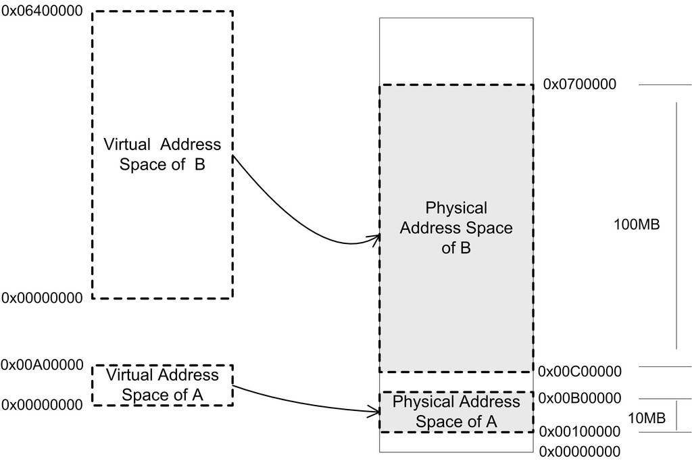
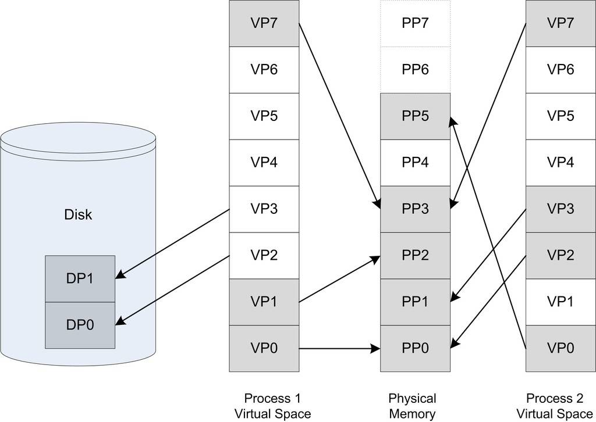

# 1.5 内存不够怎么办

上面一节中我们提到了进程的概念，进程的总体目标是希望每个进程从逻辑上来看都可以独占计算机的资源。操作系统的多任务功能使得CPU能够在多个进程之间很好地共享，从进程的角度看好像是它独占了CPU而不用考虑与其他进程分享CPU的事情。操作系统的I/O抽象模型也很好地实现了I/O设备的共享和抽象，那么唯一剩下的就是主存，也就是内存的分配问题了。

在早期的计算机中，程序是直接运行在物理内存上的，也就是说，程序在运行时所访问的地址都是物理地址。当然，如果一个计算机同时只运行一个程序，那么只要程序要求的内存空间不要超过物理内存的大小，就不会有问题。但事实上为了更有效地利用硬件资源，我们必须同时运行多个程序，正如前面的多道程序、分时系统和多任务中一样，当我们能够同时运行多个程序时，CPU的利用率将会比较高。那么很明显的一个问题是，如何将计算机上有限的物理内存分配给多个程序使用。

假设我们的计算机有128 MB内存，程序A运行需要10 MB，程序B需要100MB，程序C需要20MB。如果我们需要同时运行程序A和B，那么比较直接的做法是将内存的前10MB分配给程序A，10MB～110MB分配给B。这样就能够实现A和B两个程序同时运行，但是这种简单的内存分配策略问题很多。

- **地址空间不隔离** 所有程序都直接访问物理地址，程序所使用的内存空间不是相互隔离的。恶意的程序可以很容易改写其他程序的内存数据，以达到破坏的目的；有些非恶意的、但是有臭虫的程序可能不小心修改了其他程序的数据，就会使其他程序也崩溃，这对于需要安全稳定的计算环境的用户来说是不能容忍的。用户希望他在使用计算机的时候，其中一个任务失败了，至少不会影响其他任务。
- **内存使用效率低** 由于没有有效的内存管理机制，通常需要一个程序执行时，监控程序就将整个程序装入内存中然后开始执行。如果我们忽然需要运行程序C，那么这时内存空间其实已经不够了，这时候我们可以用的一个办法是将其他程序的数据暂时写到磁盘里面，等到需要用到的时候再读回来。由于程序所需要的空间是连续的，那么这个例子里面，如果我们将程序A换出到磁盘所释放的内存空间是不够的，所以只能将B换出到磁盘，然后将C读入到内存开始运行。可以看到整个过程中有大量的数据在换入换出，导致效率十分低下。
- **程序运行的地址不确定** 因为程序每次需要装入运行时，我们都需要给它从内存中分配一块足够大的空闲区域，这个空闲区域的位置是不确定的。这给程序的编写造成了一定的麻烦，因为程序在编写时，它访问数据和指令跳转时的目标地址很多都是固定的，这涉及程序的重定位问题，我们在第2部分和第3部分还会详细探讨重定位的问题。

解决这几个问题的思路就是使用我们前文提到过的法宝：增加中间层，即使用一种间接的地址访问方法。整个想法是这样的，我们把程序给出的地址看作是一种虚拟地址（Virtual Address），然后通过某些映射的方法，将这个虚拟地址转换成实际的物理地址。这样，只要我们能够妥善地控制这个虚拟地址到物理地址的映射过程，就可以保证任意一个程序所能够访问的物理内存区域跟另外一个程序相互不重叠，以达到地址空间隔离的效果。

## 1.5.1 关于隔离

让我们回到程序的运行本质上来。用户程序在运行时不希望介入到这些复杂的存储器管理过程中，作为普通的程序，它需要的是一个简单的执行环境，有一个单一的地址空间、有自己的CPU，好像整个程序占有整个计算机而不用关心其他的程序（当然程序间通信的部分除外，因为这是程序主动要求跟其他程序通信和联系）。所谓的地址空间是个比较抽象的概念，你可以把它想象成一个很大的数组，每个数组的元素是一个字节，而这个数组大小由地址空间的地址长度决定，比如32位的地址空间的大小为2 \^ 32 = 4294967296字节，即4GB，地址空间有效的地址是 0～4294967295，用十六进制表示就是0x00000000～0xFFFFFFFF。地址空间分两种：虚拟地址空间（Virtual Address Space）和物理地址空间（Physical Address Space）。物理地址空间是实实在在存在的，存在于计算机中，而且对于每一台计算机来说只有唯一的一个，你可以把物理空间想象成物理内存，比如你的计算机用的是Intel的Pentium 4的处理器，那么它是32位的机器，即计算机地址线有32条（实际上是36条地址线，不过我们暂时认为它只是32条），那么物理空间就有4GB。但是你的计算机上只装了512MB的内存，那么其实物理地址的真正有效部分只有0x00000000～0x1FFFFFFF，其他部分都是无效的（实际上还有一些外部I/O设备映射到物理空间的，也是有效的，但是我们暂时无视其存在）。虚拟地址空间是指虚拟的、人们想象出来的地址空间，其实它并不存在，每个进程都有自己独立的虚拟空间，而且每个进程只能访问自己的地址空间，这样就有效地做到了进程的隔离。

## 1.5.2 分段（Segmentation）

最开始人们使用的是一种叫做分段（Segmentation）的方法，基本思路是把一段与程序所需要的内存空间大小的虚拟空间映射到某个地址空间。比如程序A需要10MB内存，那么我们假设有一个地址从0x00000000到0x00A00000的10MB大小的一个假象的空间，也就是虚拟空间，然后我们从实际的物理内存中分配一个相同大小的物理地址，假设是物理地址0x00100000开始到0x00B00000结束的一块空间。然后我们把这两块相同大小的地址空间一一映射，即虚拟空间中的每个字节相对应于物理空间中的每个字节。这个映射过程由软件来设置，比如操作系统来设置这个映射函数，实际的地址转换由硬件完成。比如当程序A中访问地址0x00001000时，CPU会将这个地址转换成实际的物理地址0x00101000。那么比如程序A和程序B在运行时，它们的虚拟空间和物理空间映射关系可能如图1-5所示。

\
图1-5 段映射机制

分段的方法基本解决了上面提到的3个问题中的第一个和第三个。首先它做到了地址隔离，因为程序A和程序B被映射到了两块不同的物理空间区域，它们之间没有任何重叠，如果程序A访问虚拟空间的地址超出了0x00A00000这个范围，那么硬件就会判断这是一个非法的访问，拒绝这个地址请求，并将这个请求报告给操作系统或监控程序，由它来决定如何处理。再者，对于每个程序来说，无论它们被分配到物理地址的哪一个区域，对于程序来说都是透明的，它们不需要关心物理地址的变化，它们只需要按照从地址0x00000000到0x00A00000来编写程序、放置变量，所以程序不再需要重定位。

但是分段的这种方法还是没有解决我们的第二个问题，即内存使用效率的问题。分段对内存区域的映射还是按照程序为单位，如果内存不足，被换入换出到磁盘的都是整个程序，这样势必会造成大量的磁盘访问操作，从而严重影响速度，这种方法还是显得粗糙，粒度比较大。事实上，根据程序的局部性原理，当一个程序在运行时，在某个时间段内，它只是频繁地用到了一小部分数据，也就是说，程序的很多数据其实在一个时间段内都是不会被用到的。人们很自然地想到了更小粒度的内存分割和映射的方法，使得程序的局部性原理得到充分的利用，大大提高了内存的使用率。这种方法就是分页（Paging）。

## 1.5.3 分页（Paging）

分页的基本方法是把地址空间人为地等分成固定大小的页，每一页的大小由硬件决定，或硬件支持多种大小的页，由操作系统选择决定页的大小。比如Intel Pentium系列处理器支持4KB或4MB的页大小，那么操作系统可以选择每页大小为4KB，也可以选择每页大小为4MB，但是在同一时刻只能选择一种大小，所以对整个系统来说，页就是固定大小的。目前几乎所有的PC上的操作系统都使用4KB大小的页。我们使用的PC机是32位的虚拟地址空间，也就是4GB，那么按4KB每页分的话，总共有1048576个页。物理空间也是同样的分法。

下面我们来看一个简单的例子，如图1-6所示，每个虚拟空间有8页，每页大小为1KB，那么虚拟地址空间就是8KB。我们假设该计算机有13条地址线，即拥有2\^13的物理寻址能力，那么理论上物理空间可以多达8KB。但是出于种种原因，购买内存的资金不够，只买得起6KB的内存，所以物理空间其实真正有效的只是前6KB。

\
图1-6 进程虚拟空间、物理空间和磁盘之间的页映射关系

那么，当我们把进程的虚拟地址空间按页分割，把常用的数据和代码页装载到内存中，把不常用的代码和数据保存在磁盘里，当需要用到的时候再把它从磁盘里取出来即可。以图1-6为例，我们假设有两个进程Process1和Process2，它们进程中的部分虚拟页面被映射到了物理页面，比如VP0、VP1和VP7映射到PP0、PP2和PP3；而有部分页面却在磁盘中，比如VP2和VP3位于磁盘的DP0和DP1中；另外还有一些页面如VP4、VP5和VP6可能尚未被用到或访问到，它们暂时处于未使用的状态。在这里，我们把虚拟空间的页就叫虚拟页（VP，Virtual Page），把物理内存中的页叫做物理页（PP，Physical Page），把磁盘中的页叫做磁盘页（DP，Disk Page）。图中的线表示映射关系，我们可以看到虚拟空间的有些页被映射到同一个物理页，这样就可以实现内存共享。

图1-6中Process1的VP2和VP3不在内存中，但是当进程需要用到这两个页的时候，硬件会捕获到这个消息，就是所谓的页错误（Page Fault），然后操作系统接管进程，负责将VP2和VP3从磁盘中读出来并且装入内存，然后将内存中的这两个页与VP2和VP3之间建立映射关系。以页为单位来存取和交换这些数据非常方便，硬件本身就支持这种以页为单位的操作方式。

保护也是页映射的目的之一，简单地说就是每个页可以设置权限属性，谁可以修改，谁可以访问等，而只有操作系统有权限修改这些属性，那么操作系统就可以做到保护自己和保护进程。对于保护，我们这里只是简单介绍，详细的介绍和为什么要保护我们将会在本书的第2部分再介绍。

虚拟存储的实现需要依靠硬件的支持，对于不同的CPU来说是不同的。但是几乎所有的硬件都采用一个叫MMU（Memory Management Unit）的部件来进行页映射，如图1-7所示。

\
图1-7 虚拟地址到物理地址的转换

在页映射模式下，CPU发出的是Virtual Address，即我们的程序看到的是虚拟地址。经过MMU转换以后就变成了Physical Address。一般MMU都集成在CPU内部了，不会以独立的部件存在。
