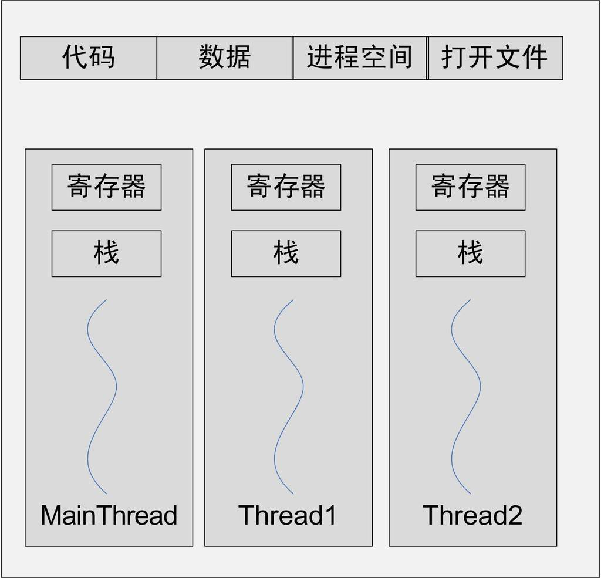
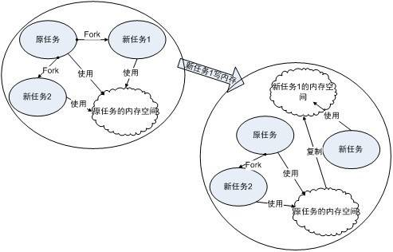
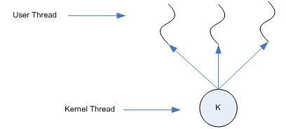
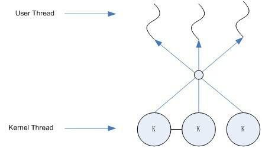

# 1.6 众人拾柴火焰高

## 1.6.1 线程基础

现代软件系统中，除了进程之外，线程也是一个十分重要的概念。特别是随着CPU频率增长开始出现停滞，而开始向多核方向发展。多线程，作为实现软件并发执行的一个重要的方法，也开始具有越来越重要的地位。我们将在这一节回顾线程相关的内容，包括线程的概念、线程的调度、线程安全、用户线程与内核线程之间的映射关系。虽然线程相关的概念与本书的内容并不是十分相关，但是我们相信深刻地理解线程对于更加深入地理解装载、动态链接和运行库，特别是运行库与多线程相关部分的内容会有很大的帮助。

### 什么是线程

线程（Thread），有时被称为轻量级进程（Lightweight Process，LWP），是程序执行流的最小单元。一个标准的线程由线程ID、当前指令指针（PC）、寄存器集合和堆栈组成。通常意义上，一个进程由一个到多个线程组成，各个线程之间共享程序的内存空间（包括代码段、数据段、堆等）及一些进程级的资源（如打开文件和信号）。一个经典的线程与进程的关系如图1-8所示。

\
图1-8 进程内的线程

大多数软件应用中，线程的数量都不止一个。多个线程可以互不干扰地并发执行，并共享进程的全局变量和堆的数据。那么，多个线程与单线程的进程相比，又有哪些优势呢？通常来说，使用多线程的原因有如下几点。

- 某个操作可能会陷入长时间等待，等待的线程会进入睡眠状态，无法继续执行。多线程执行可以有效利用等待的时间。典型的例子是等待网络响应，这可能要花费数秒甚至数十秒。
- 某个操作（常常是计算）会消耗大量的时间，如果只有一个线程，程序和用户之间的交互会中断。多线程可以让一个线程负责交互，另一个线程负责计算。
- 程序逻辑本身就要求并发操作，例如一个多端下载软件（例如BitTorrent）。
- 多CPU或多核计算机（基本就是未来的主流计算机），本身具备同时执行多个线程的能力，因此单线程程序无法全面地发挥计算机的全部计算能力。
- 相对于多进程应用，多线程在数据共享方面效率要高很多。

### 线程的访问权限

线程的访问非常自由，它可以访问进程内存里的所有数据，甚至包括其他线程的堆栈（如果它知道其他线程的堆栈地址，那么这就是很少见的情况），但实际运用中线程也拥有自己的私有存储空间，包括以下几方面。

- 栈（尽管并非完全无法被其他线程访问，但一般情况下仍然可以认为是私有的数据）。
- 线程局部存储（Thread Local Storage，TLS）。线程局部存储是某些操作系统为线程单独提供的私有空间，但通常只具有很有限的容量。
- 寄存器（包括PC寄存器），寄存器是执行流的基本数据，因此为线程私有。

从C程序员的角度来看，数据在线程之间是否私有如表1-1所示。

\
表1-1

### 线程调度与优先级

不论是在多处理器的计算机上还是在单处理器的计算机上，线程总是"并发"执行的。当线程数量小于等于处理器数量时（并且操作系统支持多处理器），线程的并发是真正的并发，不同的线程运行在不同的处理器上，彼此之间互不相干。但对于线程数量大于处理器数量的情况，线程的并发会受到一些阻碍，因为此时至少有一个处理器会运行多个线程。

在单处理器对应多线程的情况下，并发是一种模拟出来的状态。操作系统会让这些多线程程序轮流执行，每次仅执行一小段时间（通常是几十到几百毫秒），这样每个线程就"看起来"在同时执行。这样的一个不断在处理器上切换不同的线程的行为称之为线程调度（Thread Schedule）。在线程调度中，线程通常拥有至少三种状态，分别是：

- 运行（Running）：此时线程正在执行。
- 就绪（Ready）：此时线程可以立刻运行，但CPU已经被占用。
- 等待（Waiting）：此时线程正在等待某一事件（通常是I/O或同步）发生，无法执行。

处于运行中线程拥有一段可以执行的时间，这段时间称为时间片（Time
Slice），当时间片用尽的时候，该进程将进入就绪状态。如果在时间片用尽之前进程就开始等待某事件，那么它将进入等待状态。每当一个线程离开运行状态时，调度系统就会选择一个其他的就绪线程继续执行。在一个处于等待状态的线程所等待的事件发生之后，该线程将进入就绪状态。这3个状态的转移如图1-9所示。

\
图1-9 线程状态切换

线程调度自多任务操作系统问世以来就不断地被提出不同的方案和算法。现在主流的调度方式尽管各不相同，但都带有优先级调度（Priority
Schedule）和轮转法（Round Robin）的痕迹。所谓轮转法，即是之前提到的让各个线程轮流执行一小段时间的方法。这决定了线程之间交错执行的特点。而优先级调度则决定了线程按照什么顺序轮流执行。在具有优先级调度的系统中，线程都拥有各自的线程优先级（Thread Priority）。具有高优先级的线程会更早地执行，而低优先级的线程常常要等待到系统中已经没有高优先级的可执行的线程存在时才能够执行。在Windows中，可以通过使用：

```c
BOOL WINAPI SetThreadPriority(HANDLE hThread, int nPriority);
```

来设置线程的优先级，而Linux下与线程相关的操作可以通过pthread库来实现。

在Windows和Linux中，线程的优先级不仅可以由用户手动设置，系统还会根据不同线程的表现自动调整优先级，以使得调度更有效率。例如通常情况下，频繁地进入等待状态（进入等待状态，会放弃之后仍然可占用的时间份额）的线程（例如处理I/O的线程）比频繁进行大量计算、以至于每次都要把时间片全部用尽的线程要受欢迎得多。其实道理很简单，频繁等待的线程通常只占用很少的时间，CPU也喜欢先捏软柿子。我们一般把频繁等待的线程称之为IO密集型线程（IO Bound Thread），而把很少等待的线程称为CPU密集型线程（CPU Bound Thread）。IO密集型线程总是比CPU密集型线程容易得到优先级的提升。

在优先级调度下，存在一种饿死（Starvation）的现象，一个线程被饿死，是说它的优先级较低，在它执行之前，总是有较高优先级的线程试图执行，因此这个低优先级线程始终无法执行。当一个CPU密集型的线程获得较高的优先级时，许多低优先级的进程就很可能饿死。而一个高优先级的IO密集型线程由于大部分时间都处于等待状态，因此相对不容易造成其他线程饿死。为了避免饿死现象，调度系统常常会逐步提升那些等待了过长时间的得不到执行的线程的优先级。在这样的手段下，一个线程只要等待足够长的时间，其优先级一定会提高到足够让它执行的程度。

让我们总结一下，在优先级调度的环境下，线程的优先级改变一般有三种方式。

- 用户指定优先级。
- 根据进入等待状态的频繁程度提升或降低优先级。
- 长时间得不到执行而被提升优先级。

### 可抢占线程和不可抢占线程

我们之前讨论的线程调度有一个特点，那就是线程在用尽时间片之后会被强制剥夺继续执行的权利，而进入就绪状态，这个过程叫做抢占（Preemption），即之后执行的别的线程抢占了当前线程。在早期的一些系统（例如Windows 3.1）里，线程是不可抢占的。线程必须手动发出一个放弃执行的命令，才能让其他的线程得到执行。在这样的调度模型下，线程必须主动进入就绪状态，而不是靠时间片用尽来被强制进入。如果线程始终拒绝进入就绪状态，并且也不进行任何的等待操作，那么其他的线程将永远无法执行。在不可抢占线程中，线程主动放弃执行无非两种情况。

- 当线程试图等待某事件时（I/O等）。
- 线程主动放弃时间片。

因此，在不可抢占线程执行的时候，有一个显著的特点，那就是线程调度的时机是确定的，线程调度只会发生在线程主动放弃执行或线程等待某事件的时候。这样可以避免一些因为抢占式线程里调度时机不确定而产生的问题（见下一节：线程安全）。但即使如此，非抢占式线程在今日已经十分少见。

### Linux的多线程

Windows对进程和线程的实现如同教科书一般标准，Windows内核有明确的线程和进程的概念。在Windows API中，可以使用明确的API：CreateProcess和CreateThread来创建进程和线程，并且有一系列的API来操纵它们。但对于Linux来说，线程并不是一个通用的概念。

Linux对多线程的支持颇为贫乏，事实上，在Linux内核中并不存在真正意义上的线程概念。Linux将所有的执行实体（无论是线程还是进程）都称为任务（Task），每一个任务概念上都类似于一个单线程的进程，具有内存空间、执行实体、文件资源等。不过，Linux下不同的任务之间可以选择共享内存空间，因而在实际意义上，共享了同一个内存空间的多个任务构成了一个进程，这些任务也就成了这个进程里的线程。在Linux下，用以下方法可以创建一个新的任务，如表1-2所示。

\
表1-2

fork函数产生一个和当前进程完全一样的新进程，并和当前进程一样从fork函数里返回。例如如下代码：

```c
pid_t pid;
if (pid = fork())
{
    ...
}
```

在fork函数调用之后，新的任务将启动并和本任务一起从fork函数返回。但不同的是本任务的fork将返回新任务pid，而新任务的fork将返回0。

fork产生新任务的速度非常快，因为fork并不复制原任务的内存空间，而是和原任务一起共享一个写时复制（Copy on Write，COW）的内存空间（见图1-10）。所谓写时复制，指的是两个任务可以同时自由地读取内存，但任意一个任务试图对内存进行修改时，内存就会复制一份提供给修改方单独使用，以免影响到其他的任务使用。

\
图1-10 写时复制（Copy-On-Write）

fork只能够产生本任务的镜像，因此须要使用exec配合才能够启动别的新任务。exec可以用新的可执行映像替换当前的可执行映像，因此在fork产生了一个新任务之后，新任务可以调用exec来执行新的可执行文件。fork和exec通常用于产生新任务，而如果要产生新线程，则可以使用clone。clone函数的原型如下：

```c
int clone(int (*fn)(void*), void* child_stack, int flags, void* arg);
```

使用clone可以产生一个新的任务，从指定的位置开始执行，并且（可选的）共享当前进程的内存空间和文件等。如此就可以在实际效果上产生一个线程。

## 1.6.2 线程安全

多线程程序处于一个多变的环境当中，可访问的全局变量和堆数据随时都可能被其他的线程改变。因此多线程程序在并发时数据的一致性变得非常重要。

### 竞争与原子操作

多个线程同时访问一个共享数据，可能造成很恶劣的后果。下面是一个著名的例子，假设有两个线程分别要执行如表1-3所示的C代码。

\
表1-3

在许多体系结构上，++i的实现方法会如下：

1. 读取i到某个寄存器X。
2. X++。
3. 将X的内容存储回i。

由于线程1和线程2并发执行，因此两个线程的执行序列很可能如下（注意，寄存器X的内容在不同的线程中是不一样的，这里用X\[1\]和X\[2\]分别表示线程1和线程2中的X），如表1-4所示。

\
表1-4

从程序逻辑来看，两个线程都执行完毕之后，i的值应该为1，但从之前的执行序列可以看到，i得到的值是0。实际上这两个线程如果同时执行的话，i的结果有可能是0或1或2。可见，两个程序同时读写同一个共享数据会导致意想不到的后果。

很明显，自增（++）操作在多线程环境下会出现错误是因为这个操作被编译为汇编代码之后不止一条指令，因此在执行的时候可能执行了一半就被调度系统打断，去执行别的代码。我们把单指令的操作称为原子的（Atomic），因为无论如何，单条指令的执行是不会被打断的。为了避免出错，很多体系结构都提供了一些常用操作的原子指令，例如i386就有一条inc指令可以直接增加一个内存单元值，可以避免出现上例中的错误情况。在Windows里，有一套API专门进行一些原子操作（见表1-5），这些API称为Interlocked API。

\
表1-5

使用这些函数时，Windows将保证是原子操作的，因此可以不用担心出现问题。遗憾的是，尽管原子操作指令非常方便，但是它们仅适用于比较简单特定的场合。在复杂的场合下，比如我们要保证一个复杂的数据结构更改的原子性，原子操作指令就力不从心了。这里我们需要更加通用的手段：锁。

### 同步与锁

为了避免多个线程同时读写同一个数据而产生不可预料的后果，我们需要将各个线程对同一个数据的访问同步（Synchronization）。所谓同步，既是指在一个线程访问数据未结束的时候，其他线程不得对同一个数据进行访问。如此，对数据的访问被原子化了。

同步的最常见方法是使用锁（Lock）。锁是一种非强制机制，每一个线程在访问数据或资源之前首先试图获取（Acquire）锁，并在访问结束之后释放（Release）锁。在锁已经被占用的时候试图获取锁时，线程会等待，直到锁重新可用。

二元信号量（Binary Semaphore）是最简单的一种锁，它只有两种状态：占用与非占用。它适合只能被唯一一个线程独占访问的资源。当二元信号量处于非占用状态时，第一个试图获取该二元信号量的线程会获得该锁，并将二元信号量置为占用状态，此后其他的所有试图获取该二元信号量的线程将会等待，直到该锁被释放。

对于允许多个线程并发访问的资源，多元信号量简称信号量（Semaphore），它是一个很好的选择。一个初始值为N的信号量允许N个线程并发访问。线程访问资源的时候首先获取信号量，进行如下操作：

- 将信号量的值减1。
- 如果信号量的值小于0，则进入等待状态，否则继续执行。

访问完资源之后，线程释放信号量，进行如下操作：

- 将信号量的值加1。
- 如果信号量的值小于1，唤醒一个等待中的线程。

互斥量（Mutex）和二元信号量很类似，资源仅同时允许一个线程访问，但和信号量不同的是，信号量在整个系统可以被任意线程获取并释放，也就是说，同一个信号量可以被系统中的一个线程获取之后由另一个线程释放。而互斥量则要求哪个线程获取了互斥量，哪个线程就要负责释放这个锁，其他线程越俎代庖去释放互斥量是无效的。

临界区（Critical Section）是比互斥量更加严格的同步手段。在术语中，把临界区的锁的获取称为进入临界区，而把锁的释放称为离开临界区。临界区和互斥量与信号量的区别在于，互斥量和信号量在系统的任何进程里都是可见的，也就是说，一个进程创建了一个互斥量或信号量，另一个进程试图去获取该锁是合法的。然而，临界区的作用范围仅限于本进程，其他的进程无法获取该锁。除此之外，临界区具有和互斥量相同的性质。

读写锁（Read-Write Lock）致力于一种更加特定的场合的同步。对于一段数据，多个线程同时读取总是没有问题的，但假设操作都不是原子型，只要有任何一个线程试图对这个数据进行修改，就必须使用同步手段来避免出错。如果我们使用上述信号量、互斥量或临界区中的任何一种来进行同步，尽管可以保证程序正确，但对于读取频繁，而仅仅偶尔写入的情况，会显得非常低效。读写锁可以避免这个问题。对于同一个锁，读写锁有两种获取方式，共享的（Shared）或独占的（Exclusive）。当锁处于自由的状态时，试图以任何一种方式获取锁都能成功，并将锁置于对应的状态。如果锁处于共享状态，其他线程以共享的方式获取锁仍然会成功，此时这个锁分配给了多个线程。然而，如果其他线程试图以独占的方式获取已经处于共享状态的锁，那么它将必须等待锁被所有的线程释放。相应地，处于独占状态的锁将阻止任何其他线程获取该锁，不论它们试图以哪种方式获取。读写锁的行为可以总结如表1-6所示。

\
表1-6

条件变量（Condition Variable）作为一种同步手段，作用类似于一个栅栏。对于条件变量，线程可以有两种操作，首先线程可以等待条件变量，一个条件变量可以被多个线程等待。其次，线程可以唤醒条件变量，此时某个或所有等待此条件变量的线程都会被唤醒并继续支持。也就是说，使用条件变量可以让许多线程一起等待某个事件的发生，当事件发生时（条件变量被唤醒），所有的线程可以一起恢复执行。

### 可重入（Reentrant）与线程安全

一个函数被重入，表示这个函数没有执行完成，由于外部因素或内部调用，又一次进入该函数执行。一个函数要被重入，只有两种情况：

1. 多个线程同时执行这个函数。
2. 函数自身（可能是经过多层调用之后）调用自身。

一个函数被称为可重入的，表明该函数被重入之后不会产生任何不良后果。举个例子，如下面这个sqr函数就是可重入的：

```c
int sqr(int x)
{
    return x * x;
}
```

一个函数要成为可重入的，必须具有如下几个特点：

- 不使用任何（局部）静态或全局的非const变量。
- 不返回任何（局部）静态或全局的非const变量的指针。
- 仅依赖于调用方提供的参数。
- 不依赖任何单个资源的锁（mutex等）。
- 不调用任何不可重入的函数。

可重入是并发安全的强力保障，一个可重入的函数可以在多线程环境下放心使用。

### 过度优化

线程安全是一个非常烫手的山芋，因为即使合理地使用了锁，也不一定能保证线程安全，这是源于落后的编译器技术已经无法满足日益增长的并发需求。很多看似无错的代码在优化和并发面前又产生了麻烦。最简单的例子，让我们看看如下代码：

```c
x = 0;
Thread1    Thread2
lock();    lock();
x++;       x++;
unlock();  unlock();
```

由于有lock和unlock的保护，x++的行为不会被并发所破坏，那么x的值似乎必然是2了。然而，如果编译器为了提高x的访问速度，把x放到了某个寄存器里，那么我们知道不同线程的寄存器是各自独立的，因此如果Thread1先获得锁，则程序的执行可能会呈现如下的情况：

- \[Thread1\]读取x的值到某个寄存器R\[1\]（R\[1\]=0）。
- \[Thread1\]R\[1\]++（由于之后可能还要访问x，因此Thread1暂时不将R\[1\]写回x）。
- \[Thread2\]读取x的值到某个寄存器R\[2\]（R\[2\]=0）。
- \[Thread2\]R\[2\]++(R\[2\]=1)。
- \[Thread2\]将R\[2\]写回至x(x=1)。
- \[Thread1\]（很久以后）将R\[1\]写回至x(x=1)。

可见在这样的情况下即使正确地加锁，也不能保证多线程安全。下面是另一个例子：

```c
x = y = 0;
Thread1    Thread2
x = 1;     y = 1;
r1 = y;    r2 = x;
```

很显然，r1和r2至少有一个为1，逻辑上不可能同时为0。然而，事实上r1=r2=0的情况确实可能发生。原因在于早在几十年前，CPU就发展出了动态调度，在执行程序的时候为了提高效率有可能交换指令的顺序。同样，编译器在进行优化的时候，也可能为了效率而交换毫不相干的两条相邻指令（如x=1和r1=y）的执行顺序。也就是说，以上代码执行的时候可能是这样的：

```c
x = y = 0;
Thread1    Thread2
r1 = y;    y = 1;
x = 1;     r2 = x;
```

那么r1=r2=0就完全可能了。我们可以使用volatile关键字试图阻止过度优化，volatile基本可以做到两件事情：

1. 阻止编译器为了提高速度将一个变量缓存到寄存器内而不写回。
2. 阻止编译器调整操作volatile变量的指令顺序。

可见volatile可以完美地解决第一个问题，但是volatile是否也能解决第二个问题呢？答案是不能。因为即使volatile能够阻止编译器调整顺序，也无法阻止CPU动态调度换序。

另一个颇为著名的与换序有关的问题来自于Singleton模式的double-check。一段典型的double-check的singleton代码是这样的（不熟悉Singleton的读者可以参考《设计模式：可复用面向对象软件的基础》，但下面所介绍的内容并不真正需要了解Singleton）：

```c
volatile T* pInst = 0;
T* GetInstance()
{
    if (pInst == NULL)
    {
        lock();
        if (pInst == NULL)
            pInst = new T;
        unlock();
    }
    return pInst;
}
```

抛开逻辑，这样的代码乍看是没有问题的，当函数返回时，PInst总是指向一个有效的对象。而lock和unlock防止了多线程竞争导致的麻烦。双重的if在这里另有妙用，可以让lock的调用开销降低到最小。读者可以自己揣摩。

但是实际上这样的代码是有问题的。问题的来源仍然是CPU的乱序执行。C++里的new其实包含了两个步骤：

1. 分配内存。
2. 调用构造函数。

所以pInst = new T包含了三个步骤：

1. 分配内存。
2. 在内存的位置上调用构造函数。
3. 将内存的地址赋值给pInst。

在这三步中，（2）和（3）的顺序是可以颠倒的。也就是说，完全有可能出现这样的情况：pInst的值已经不是NULL，但对象仍然没有构造完毕。这时候如果出现另外一个对GetInstance的并发调用，此时第一个if内的表达式pInst==NULL为false，所以这个调用会直接返回尚未构造完全的对象的地址（pInst）以提供给用户使用。那么程序这个时候会不会崩溃就取决于这个类的设计如何了。

从上面两个例子可以看到CPU的乱序执行能力让我们对多线程的安全保障的努力变得异常困难。因此要保证线程安全，阻止CPU换序是必需的。遗憾的是，现在并不存在可移植的阻止换序的方法。通常情况下是调用CPU提供的一条指令，这条指令常常被称为barrier。一条barrier指令会阻止CPU将该指令之前的指令交换到barrier之后，反之亦然。换句话说，barrier指令的作用类似于一个拦水坝，阻止换序"穿透"这个大坝。

许多体系结构的CPU都提供barrier指令，不过它们的名称各不相同，例如POWERPC提供的其中一条指令名叫lwsync。我们可以这样来保证线程安全：

```c
#define barrier() __asm__ volatile ("lwsync")
volatile T* pInst = 0;
T* GetInstance()
{
    if (!pInst)
    {
        lock();
        if (!pInst)
        {
            T* temp = new T;
            barrier();
            pInst = temp;
        }
        unlock();
    }
    return pInst;
}
```

由于barrier的存在，对象的构造一定在barrier执行之前完成，因此当pInst被赋值时，对象总是完好的。

## 1.6.3 多线程内部情况

### 三种线程模型

线程的并发执行是由多处理器或操作系统调度来实现的。但实际情况要更为复杂一些：大多数操作系统，包括Windows和Linux，都在内核里提供线程的支持，内核线程（注：这里的内核线程和Linux内核里的kernel_thread并不是一回事）和我们之前讨论的一样，由多处理器或调度来实现并发。然而用户实际使用的线程并不是内核线程，而是存在于用户态的用户线程。用户态线程并不一定在操作系统内核里对应同等数量的内核线程，例如某些轻量级的线程库，对用户来说如果有三个线程在同时执行，对内核来说很可能只有一个线程。本节我们将详细介绍用户态多线程库的实现方式。

#### 1. 一对一模型

对于直接支持线程的系统，一对一模型始终是最为简单的模型。对一对一模型来说，一个用户使用的线程就唯一对应一个内核使用的线程（但反过来不一定，一个内核里的线程在用户态不一定有对应的线程存在），如图1-11所示。

\
图1-11 一对一线程模型

这样用户线程就具有了和内核线程一致的优点，线程之间的并发是真正的并发，一个线程因为某原因阻塞时，其他线程执行不会受到影响。此外，一对一模型也可以让多线程程序在多处理器的系统上有更好的表现。

一般直接使用API或系统调用创建的线程均为一对一的线程。例如在Linux里使用clone（带有CLONE_VM参数）产生的线程就是一个一对一线程，因为此时在内核有一个唯一的线程与之对应。下列代码演示了这一过程：

```c
int thread_function(void*)
{ ... }
char thread_stack[4096];

void foo
{
    clone(thread_function, thread_stack, CLONE_VM, 0);
}
```

在Windows里，使用API CreateThread即可创建一个一对一的线程。

一对一线程缺点有两个：

- 由于许多操作系统限制了内核线程的数量，因此一对一线程会让用户的线程数量受到限制。
- 许多操作系统内核线程调度时，上下文切换的开销较大，导致用户线程的执行效率下降。

#### 2. 多对一模型

多对一模型将多个用户线程映射到一个内核线程上，线程之间的切换由用户态的代码来进行，因此相对于一对一模型，多对一模型的线程切换要快速许多。多对一的模型示意图如图1-12所示。

\
图1-12 多对一线程模型

多对一模型一大问题是，如果其中一个用户线程阻塞，那么所有的线程都将无法执行，因为此时内核里的线程也随之阻塞了。另外，在多处理器系统上，处理器的增多对多对一模型的线程性能也不会有明显的帮助。但同时，多对一模型得到的好处是高效的上下文切换和几乎无限制的线程数量。

#### 3. 多对多模型

多对多模型结合了多对一模型和一对一模型的特点，将多个用户线程映射到少数但不止一个内核线程上，如图1-13所示。

在多对多模型中，一个用户线程阻塞并不会使得所有的用户线程阻塞，因为此时还有别的线程可以被调度来执行。另外，多对多模型对用户线程的数量也没什么限制，在多处理器系统上，多对多模型的线程也能得到一定的性能提升，不过提升的幅度不如一对一模型高。

\
图1-13 多对多线程模型
