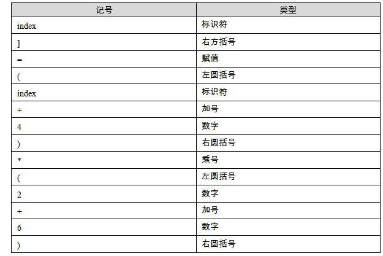
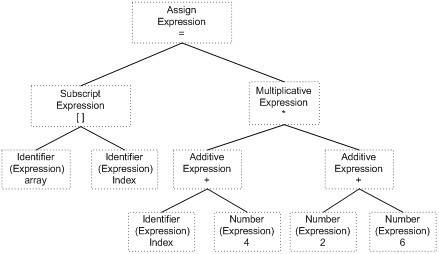

# 2.2 编译器做了什么

从最直观的角度来讲，编译器就是将高级语言翻译成机器语言的一个工具。比如我们用C/C++语言写的一个程序可以使用编译器将其翻译成机器可以执行的指令及数据。我们前面也提到了，使用机器指令或汇编语言编写程序是十分费事及乏味的事情，它们使得程序开发的效率十分低下。并且使用机器语言或汇编语言编写的程序依赖于特定的机器，一个为某种CPU编写的程序在另外一种CPU下完全无法运行，需要重新编写，这几乎是令人无法接受的。所以人们期望能够采用类似于自然语言的语言来描述一个程序，但是自然语言的形式不够精确，所以类似于数学定义的编程语言很快就诞生了。20世纪的六七十年代诞生了很多高级语言，有些至今仍然非常流行，如FORTRAN、C语言等（准确地讲，FORTRAN诞生于20世纪50年代的IBM）。高级语言使得程序员们能够更加关注程序逻辑的本身，而尽量少考虑计算机本身的限制，如字长、内存大小、通信方式、存储方式等。高级编程语言的出现使得程序开发的效率大大提高，高级语言的可移植性也使得它在多种计算机平台下能够游刃有余。据研究，高级语言的开发效率是汇编语言和机器语言的5倍以上。

让我们继续回到编译器本身的职责上来，编译过程一般可以分为6步：扫描、语法分析、语义分析、源代码优化、代码生成和目标代码优化。整个过程如图2-2所示。

\
图2-2 编译过程

我们将结合图2-2来简单描述从源代码（Source Code）到最终目标代码（Final Target Code）的过程。以一段很简单的C语言的代码为例子来讲述这个过程。比如我们有一行C语言的源代码如下：

```c
array[index] = (index + 4) * (2 + 6)
CompilerExpression.c
```

## 2.2.1 词法分析

首先源代码程序被输入到扫描器（Scanner），扫描器的任务很简单，它只是简单地进行词法分析，运用一种类似于有限状态机（Finite State Machine）的算法可以很轻松地将源代码的字符序列分割成一系列的记号（Token）。比如上面的那行程序，总共包含了28个非空字符，经过扫描以后，产生了16个记号，如表2-1所示。

\
\
表2-1

词法分析产生的记号一般可以分为如下几类：关键字、标识符、字面量（包含数字、字符串等）和特殊符号（如加号、等号）。在识别记号的同时，扫描器也完成了其他工作。比如将标识符存放到符号表，将数字、字符串常量存放到文字表等，以备后面的步骤使用。

有一个叫做lex的程序可以实现词法扫描，它会按照用户之前描述好的词法规则将输入的字符串分割成一个个记号。因为这样一个程序的存在，编译器的开发者就无须为每个编译器开发一个独立的词法扫描器，而是根据需要改变词法规则就可以了。

另外对于一些有预处理的语言，比如C语言，它的宏替换和文件包含等工作一般不归入编译器的范围而交给一个独立的预处理器。

## 2.2.2 语法分析

接下来语法分析器（Grammar Parser）将对由扫描器产生的记号进行语法分析，从而产生语法树（Syntax Tree）。整个分析过程采用了上下文无关语法（Context-free Grammar）的分析手段，如果你对上下文无关语法及下推自动机很熟悉，那么应该很好理解。否则，可以参考一些计算理论的资料，一般都会有很详细的介绍。此处不再赘述。简单地讲，由语法分析器生成的语法树就是以表达式（Expression）为节点的树。我们知道，C语言的一个语句是一个表达式，而复杂的语句是很多表达式的组合。上面例子中的语句就是一个由赋值表达式、加法表达式、乘法表达式、数组表达式、括号表达式组成的复杂语句。它在经过语法分析器以后形成如图2-3所示的语法树。

\
图2-3 语法树

从图2-3中我们可以看到，整个语句被看作是一个赋值表达式；赋值表达式的左边是一个数组表达式，它的右边是一个乘法表达式；数组表达式又由两个符号表达式组成，等等。符号和数字是最小的表达式，它们不是由其他的表达式来组成的，所以它们通常作为整个语法树的叶节点。在语法分析的同时，很多运算符号的优先级和含义也被确定下来了。比如乘法表达式的优先级比加法高，而圆括号表达式的优先级比乘法高，等等。另外有些符号具有多重含义，比如星号\*在C语言中可以表示乘法表达式，也可以表示对指针取内容的表达式，所以语法分析阶段必须对这些内容进行区分。如果出现了表达式不合法，比如各种括号不匹配、表达式中缺少操作符等，编译器就会报告语法分析阶段的错误。

正如前面词法分析有lex一样，语法分析也有一个现成的工具叫做yacc（Yet Another Compiler Compiler）。它也像lex一样，可以根据用户给定的语法规则对输入的记号序列进行解析，从而构建出一棵语法树。对于不同的编程语言，编译器的开发者只须改变语法规则，而无须为每个编译器编写一个语法分析器，所以它又被称为"编译器编译器（Compiler Compiler）"。

## 2.2.3 语义分析

接下来进行的是语义分析，由语义分析器（Semantic Analyzer）来完成。语法分析仅仅是完成了对表达式的语法层面的分析，但是它并不了解这个语句是否真正有意义。比如C语言里面两个指针做乘法运算是没有意义的，但是这个语句在语法上是合法的；比如同样一个指针和一个浮点数做乘法运算是否合法等。编译器所能分析的语义是静态语义（Static Semantic），所谓静态语义是指在编译期可以确定的语义，与之对应的动态语义（Dynamic Semantic）就是只有在运行期才能确定的语义。

静态语义通常包括声明和类型的匹配，类型的转换。比如当一个浮点型的表达式赋值给一个整型的表达式时，其中隐含了一个浮点型到整型转换的过程，语义分析过程中需要完成这个步骤。比如将一个浮点型赋值给一个指针的时候，语义分析程序会发现这个类型不匹配，编译器将会报错。动态语义一般指在运行期出现的语义相关的问题，比如将0作为除数是一个运行期语义错误。

经过语义分析阶段以后，整个语法树的表达式都被标识了类型，如果有些类型需要做隐式转换，语义分析程序会在语法树中插入相应的转换节点。上面描述的语法树在经过语义分析阶段以后成为如图2-4所示的形式。

\
图2-4 标识语义后的语法树

可以看到，每个表达式（包括符号和数字）都被标识了类型。我们的例子中几乎所有的表达式都是整型的，所以无须做转换，整个分析过程很顺利。语义分析器还对符号表里的符号类型也做了更新。

## 2.2.4 中间语言生成

现代的编译器有着很多层次的优化，往往在源代码级别会有一个优化过程。我们这里所描述的源码级优化器（Source Code Optimizer）在不同编译器中可能会有不同的定义或有一些其他的差异。源代码级优化器会在源代码级别进行优化，在上例中，细心的读者可能已经发现，（2 + 6）这个表达式可以被优化掉，因为它的值在编译期就可以被确定。类似的还有很多其他复杂的优化过程，我们在这里就不详细描述了。经过优化的语法树如图2-5所示。

\
图2-5 优化后的语法树

我们看到（2 + 6）这个表达式被优化成8。其实直接在语法树上作优化比较困难，所以源代码优化器往往将整个语法树转换成中间代码（Intermediate Code），它是语法树的顺序表示，其实它已经非常接近目标代码了。但是它一般跟目标机器和运行时环境是无关的，比如它不包含数据的尺寸、变量地址和寄存器的名字等。中间代码有很多种类型，在不同的编译器中有着不同的形式，比较常见的有：三地址码（Three-address Code）和P-代码（P-Code）。我们就拿最常见的三地址码来作为例子，最基本的三地址码是这样的：

```
x = y op z
```

这个三地址码表示将变量y和z进行op操作以后，赋值给x。这里op操作可以是算数运算，比如加减乘除等，也可以是其他任何可以应用到y和z的操作。三地址码也得名于此，因为一个三地址码语句里面有三个变量地址。我们上面的例子中的语法树可以被翻译成三地址码后是这样的：

```c
t1 = 2 + 6
t2 = index + 4
t3 = t2 * t1
array[index] = t3
```

我们可以看到，为了使所有的操作都符合三地址码形式，这里利用了几个临时变量：t1、t2和t3。在三地址码的基础上进行优化时，优化程序会将2+6的结果计算出来，得到t1 = 8。然后将后面代码中的t1替换成数字8。还可以省去一个临时变量t3，因为t2可以重复利用。经过优化以后的代码如下：

```c
t2 = index + 4
t2 = t2 * 8
array[index] = t2
```

中间代码使得编译器可以被分为前端和后端。编译器前端负责产生机器无关的中间代码，编译器后端将中间代码转换成目标机器代码。这样对于一些可以跨平台的编译器而言，它们可以针对不同的平台使用同一个前端和针对不同机器平台的数个后端。

## 2.2.5 目标代码生成与优化

源代码级优化器产生中间代码标志着下面的过程都属于编辑器后端。编译器后端主要包括代码生成器（Code Generator）和目标代码优化器（Target Code Optimizer）。让我们先来看看代码生成器。代码生成器将中间代码转换成目标机器代码，这个过程十分依赖于目标机器，因为不同的机器有着不同的字长、寄存器、整数数据类型和浮点数数据类型等。对于上面例子中的中间代码，代码生成器可能会生成下面的代码序列（我们用x86的汇编语言来表示，并且假设index的类型为int型，array的类型为int型数组）：

```
movl index, %ecx          ; value of index to ecx
addl $4, %ecx             ; ecx = ecx + 4
mull $8, %ecx             ; ecx = ecx * 8
movl index, %eax          ; value of index to eax
movl %ecx, array(,eax,4)  ; array[index] = ecx
```

最后目标代码优化器对上述的目标代码进行优化，比如选择合适的寻址方式、使用位移来代替乘法运算、删除多余的指令等。上面的例子中，乘法由一条相对复杂的基址比例变址寻址（Base Index Scale Addressing）的lea指令完成，随后由一条mov指令完成最后的赋值操作，这条mov指令的寻址方式与lea是一样的。

```
movl index, %edx
leal 32(,%edx,8), %eax
movl %eax, array(,%edx,4)
```

现代的编译器有着异常复杂的结构，这是因为现代高级编程语言本身非常地复杂，比如C++语言的定义就极为复杂，至今没有一个编译器能够完整支持C++语言标准所规定的所有语言特性。另外现代的计算机CPU相当地复杂，CPU本身采用了诸如流水线、多发射、超标量等诸多复杂的特性，为了支持这些特性，编译器的机器指令优化过程也变得十分复杂。使得编译过程更为复杂的是有些编译器支持多种硬件平台，即允许编译器编译出多种目标CPU的代码。比如著名的GCC编译器就几乎支持所有CPU平台，这也导致了编译器的指令生成过程更为复杂。

经过这些扫描、语法分析、语义分析、源代码优化、代码生成和目标代码优化，编译器忙活了这么多个步骤以后，源代码终于被编译成了目标代码。但是这个目标代码中有一个问题是：index和array的地址还没有确定。如果我们要把目标代码使用汇编器编译成真正能够在机器上执行的指令，那么index和array的地址应该从哪儿得到呢？如果index和array定义在跟上面的源代码同一个编译单元里面，那么编译器可以为index和array分配空间，确定它们的地址；那如果是定义在其他的程序模块呢？

这个看似简单的问题引出了我们一个很大的话题：目标代码中有变量定义在其他模块，该怎么办？事实上，定义其他模块的全局变量和函数在最终运行时的绝对地址都要在最终链接的时候才能确定。所以现代的编译器可以将一个源代码文件编译成一个未链接的目标文件，然后由链接器最终将这些目标文件链接起来形成可执行文件。让我们带着这个问题，走进链接的世界。
