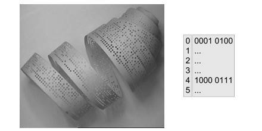
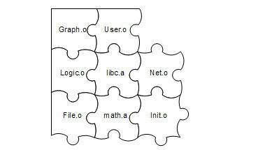

# 2.3 链接器年龄比编译器长

> 很久很久以前，在一个非常遥远的银河系……人们编写程序时，将所有源代码都写在同一个文件中，发展到后来一个程序源代码的文件长达数百万行，以至于这个地方的人类已经没有能力维护这个程序了。人们开始寻找新的办法，一场新的软件开发革命即将爆发……

为了更好地理解计算机程序的编译和链接的过程，我们简单地回顾计算机程序开发的历史一定会非常有益。计算机的程序开发并非从一开始就有着这么复杂的自动化编译、链接过程。原始的链接概念远在高级程序语言发明之前就已经存在了，在最开始的时候，程序员（当时程序员的概念应该跟现在相差很大了）先把一个程序在纸上写好，当然当时没有很高级的语言，用的都是机器语言，甚至连汇编语言都没有。当程序须要被运行时，程序员人工将他写的程序写入到存储设备上，最原始的存储设备之一就是纸带，即在纸带上打相应的孔。

这个过程我们可以通过图2-6来看到，假设有一种计算机，它的每条指令是1个字节，也就是8位。我们假设有一种跳转指令，它的高4位是0001，表示这是一条跳转指令；低4位存放的是跳转目的地的绝对地址。我们可以从图2-6中看到，这个程序的第一条指令就是一条跳转指令，它的目的地址是第5条指令（注意，第5条指令的绝对地址是4）。至于0和1怎么映射到纸带上，这个应该很容易理解，比如我们可以规定纸带上每行有8个孔位，每个孔位代表一位，穿孔表示0，未穿孔表示1。

\
图2-6 纸带与机器指令

现在问题来了，程序并不是一写好就永远不变化的，它可能会经常被修改。比如我们在第1条指令之后、第5条指令之前插入了一条或多条指令，那么第5条指令及后面的指令的位置将会相应地往后移动，原先第一条指令的低4位的数字将需要相应地调整。在这个过程中，程序员需要人工重新计算每个子程序或跳转的目标地址。当程序修改的时候，这些位置都要重新计算，十分繁琐又耗时，并且很容易出错。这种重新计算各个目标的地址过程被叫做重定位（Relocation）。

如果我们有多条纸带的程序，这些程序之间可能会有类似的跨纸带之间的跳转，这种程序经常修改导致跳转目标地址变化在程序拥有多个模块的时候更为严重。人工绑定进行指令的修正以确保所有的跳转目标地址都正确，在程序规模越来越大以后变得越来越复杂和繁琐。

没办法，这种黑暗的程序员生活是没有办法容忍的。先驱者发明了汇编语言，这相比机器语言来说是个很大的进步。汇编语言使用接近人类的各种符号和标记来帮助记忆，比如指令采用两个或三个字母的缩写，记住“jmp”比记住0001XXXX是跳转（jump）指令容易得多了；汇编语言还可以使用符号来标记位置，比如一个符号“divide”表示一个除法子程序的起始地址，比记住从某个位置开始的第几条指令是除法子程序方便得多。最重要的是，这种符号的方法使得人们从具体的指令地址中逐步解放出来。比如前面纸带程序中，我们把刚开始第5条指令开始的子程序命名为“foo”，那么第一条指令的汇编就是：

```
jmp foo
```

当然人们可以使用这种符号命名子程序或跳转目标以后，不管这个“foo”之前插入或减少了多少条指令导致“foo”目标地址发生了什么变化，汇编器在每次汇编程序的时候会重新计算“foo”这个符号的地址，然后把所有引用到“foo”的指令修正到这个正确的地址。整个过程不需要人工参与，对于一个有成百上千个类似的符号的程序，程序员终于摆脱了这种低级的繁琐的调整地址的工作，用一句政治口号来说叫做“极大地解放了生产力”。符号（Symbol）这个概念随着汇编语言的普及迅速被使用，它用来表示一个地址，这个地址可能是一段子程序（后来发展成函数）的起始地址，也可以是一个变量的起始地址。

有了汇编语言以后，生产力大大提高了，随之而来的是软件的规模也开始日渐庞大，这时程序的代码量也已经开始快速地膨胀，导致人们要开始考虑将不同功能的代码以一定的方式组织起来，使得更加容易阅读和理解，以便于日后修改和重复使用。自然而然，人们开始将代码按照功能或性质划分，分别形成不同的功能模块，不同的模块之间按照层次结构或其他结构来组织。这个在现代的软件源代码组织中很常见，比如在C语言中，最小的单位是变量和函数，若干个变量和函数组成一个模块，存放在一个“.c”的源代码文件里，然后这些源代码文件按照目录结构来组织。在比较高级的语言中，如Java中，每个类是一个基本的模块，若干个类模块组成一个包（Package），若干个包组合成一个程序。

在现代软件开发过程中，软件的规模往往都很大，动辄数百万行代码，如果都放在一个模块肯定无法想象。所以现代的大型软件往往拥有成千上万个模块，这些模块之间相互依赖又相对独立。这种按照层次化及模块化存储和组织源代码有很多好处，比如代码更容易阅读、理解、重用，每个模块可以单独开发、编译、测试，改变部分代码不需要编译整个程序等。

在一个程序被分割成多个模块以后，这些模块之间最后如何组合形成一个单一的程序是须解决的问题。模块之间如何组合的问题可以归结为模块之间如何通信的问题，最常见的属于静态语言的C/C++模块之间通信有两种方式，一种是模块间的函数调用，另外一种是模块间的变量访问。函数访问须知道目标函数的地址，变量访问也须知道目标变量的地址，所以这两种方式都可以归结为一种方式，那就是模块间符号的引用。模块间依靠符号来通信类似于拼图版，定义符号的模块多出一块区域，引用该符号的模块刚好少了那一块区域，两者一拼接刚好完美组合（见图2-7）。这个模块的拼接过程就是本书的一个主题：链接（Linking）。

\
图2-7 模块间拼合

这种基于符号的模块化的一个直接结果是链接过程在整个程序开发中变得十分重要和突出。我们在本书的后面将可以看到链接器如何将这些编译后的模块链接到一起，最终产生一个可以执行的程序。
