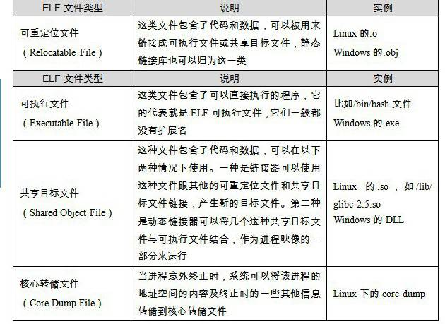

# 3.1 目标文件的格式

现在PC平台流行的可执行文件格式（Executable）主要是Windows下的PE（Portable Executable）和Linux的ELF（Executable Linkable Format），它们都是COFF（Common file format）格式的变种。目标文件就是源代码编译后但未进行链接的那些中间文件（Windows的.obj和Linux下的.o），它跟可执行文件的内容与结构很相似，所以一般跟可执行文件格式一起采用一种格式存储。从广义上看，目标文件与可执行文件的格式其实几乎是一样的，所以我们可以广义地将目标文件与可执行文件看成是一种类型的文件，在Windows下，我们可以统称它们为PE-COFF文件格式。在Linux下，我们可以将它们统称为ELF文件。其他不太常见的可执行文件格式还有Intel/Microsoft的OMF（Object Module Format）、Unix a.out格式和MS-DOS .COM格式等。

不光是可执行文件（Windows的.exe和Linux下的ELF可执行文件）按照可执行文件格式存储。动态链接库（DLL，Dynamic Linking Library）（Windows的.dll和Linux的.so）及静态链接库（Static Linking Library）（Windows的.lib和Linux的.a）文件都按照可执行文件格式存储。它们在Windows下都按照PE-COFF格式存储，Linux下按照ELF格式存储。静态链接库稍有不同，它是把很多目标文件捆绑在一起形成一个文件，再加上一些索引，你可以简单地把它理解为一个包含有很多目标文件的文件包。ELF文件标准里面把系统中采用ELF格式的文件归为如表3-1所列举的4类。

\
表3-1

我们可以在Linux下使用file命令来查看相应的文件格式，上面几种文件在file命令下会显示出相应的类型：

```
$ file foobar.o
foobar.o: ELF 32-bit LSB relocatable, Intel 80386, version 1 (SYSV), not stripped

$ file /bin/bash
/bin/bash: ELF 32-bit LSB executable, Intel 80386, version 1 (SYSV), for GNU/Linux 2.6.8, dynamically linked (uses shared libs), stripped

$ file /lib/ld-2.6.1.so
/lib/libc-2.6.1.so: ELF 32-bit LSB shared object, Intel 80386, version 1 (SYSV), for GNU/Linux 2.6.8, stripped
```

> **目标文件与可执行文件格式的小历史**
>
> 目标文件与可执行文件格式跟操作系统和编译器密切相关，所以不同的系统平台下会有不同的格式，但这些格式又大同小异，目标文件格式与可执行文件格式的历史几乎是操作系统的发展史。
>
> COFF是由Unix System V Release 3首先提出并且使用的格式规范，后来微软公司基于COFF格式，制定了PE格式标准，并将其用于当时的Windows NT系统。System V Release 4在COFF的基础上引入了ELF格式，目前流行的Linux系统也以ELF作为基本可执行文件格式。这也就是为什么目前PE和ELF如此相似的主要原因，因为它们都是源于同一种可执行文件格式COFF。
>
> Unix最早的可执行文件格式为a.out格式，它的设计非常地简单，以至于后来共享库这个概念出现的时候，a.out格式就变得捉襟见肘了。于是人们设计了COFF格式来解决这些问题，这个设计非常通用，以至于COFF的继承者到目前还在被广泛地使用。
>
> COFF的主要贡献是在目标文件里面引入了"段"的机制，不同的目标文件可以拥有不同数量及不同类型的"段"。另外，它还定义了调试数据格式。

> <sup>注意</sup> 下文的剖析我们以ELF结构为主。然后会专门分析PE-COFF文件结构，并对比其与ELF的异同。
