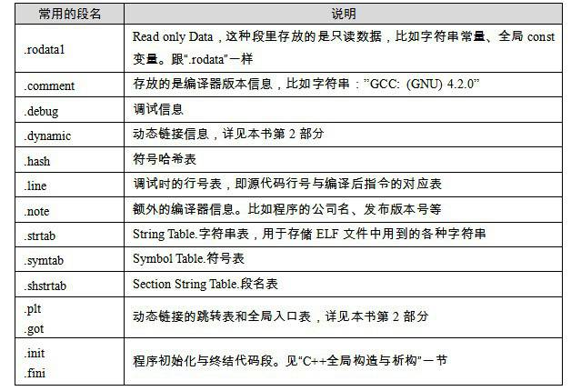

## 3.3 挖掘SimpleSection.o

前面对于目标文件只是作了概念上的阐述，如果不彻底深入目标文件的具体细节，相信这样的分析也只是泛泛而谈，没有真正深入理解的效果。就像知道TCP/IP协议是基于包的结构，但是从来却没有看到过包的结构是怎样的，包的头部有哪些内容？目标地址和源地址是怎么存放的？如果不了解这些，那么对于TCP/IP的了解是粗略的，不够细致的。很多问题其实在表面上看似很简单，其实深入内部会发现很多鲜为人知的秘密，或者发现以前自己认为理所当然的东西居然是错误的，或者是有偏差的。对于系统软件也是如此，不了解ELF文件的结构细节就像学习了TCP/IP网络没有了解IP包头的结构一样。本节后面的内容就是以ELF目标文件格式作为例子，彻底深入剖析目标文件，争取不放过任何一个字节。

> 真正了不起的程序员对自己的程序的每一个字节都了如指掌。\
> ------佚名

我们就以前面提到过的SimpleSection.c编译出来的目标文件作为分析对象，这个程序是经过精心挑选的，具有一定的代表性而又不至于过于繁琐和复杂。在接下来所进行的一系列编译、链接和相关的实验过程中，我们将会用到第1章所提到过的工具套件，比如GCC编译器、binutils等工具，如果你忘了这些工具怎么使用，那么在阅读过程中可以再回去参考本书第1部分的内容。图3-1中的程序代码如清单3-1所示。

清单3-1

    /*
     * SimpleSection.c
     *
     * Linux:
     *   gcc -c SimpleSection.c
     *
     * Windows:
     *   cl SimpleSection.c /c /Za
     */

    int printf( const char* format, ... );

    int global_init_var = 84;
    int global_uninit_var;

    void func1( int i )
    {
      printf( "%d\n",  i );
    }

    int main(void)
    {
        static int static_var = 85;
     static int static_var2;

        int a = 1;
        int b;

        func1( static_var + static_var2 + a + b );

        return a;
    }

如不加说明，则以下所分析的都是32位Intel x86平台下的ELF文件格式。

我们使用GCC来编译这个文件（参数 -c 表示只编译不链接）：

    $ gcc –c SimpleSection.c

我们得到了一个1
104字节（该文件大小可能会因为编译器版本以及机器平台不同而变化）的SimpleSection.o目标文件。我们可以使用binutils的工具objdump来查看object内部的结构，这个工具在第1部分已经介绍过了，它可以用来查看各种目标文件的结构和内容。运行以下命令：

    $ objdump -h SimpleSection.o

    SimpleSection.o:     file format elf32-i386

    Sections:
    Idx Name        Size      VMA         LMA       File off  Algn
      0 .text       0000005b  00000000  00000000  00000034  2**2
                    CONTENTS, ALLOC, LOAD, RELOC, READONLY, CODE
      1 .data       00000008  00000000  00000000  00000090  2**2
                    CONTENTS, ALLOC, LOAD, DATA
      2 .bss        00000004  00000000  00000000  00000098  2**2
                    ALLOC
      3 .rodata     00000004  00000000  00000000  00000098  2**0
                    CONTENTS, ALLOC, LOAD, READONLY, DATA
      4 .comment    0000002a  00000000  00000000  0000009c  2**0
                    CONTENTS, READONLY
      5 .note.GNU-stack 00000000  00000000  00000000  000000c6  2**0
                    CONTENTS, READONLY

GCC和binutils可被移植到各种平台上，所以它们支持多种目标文件格式。比如Windows下的GCC和binutils支持PE文件格式、Linux版本支持ELF格式。Linux还有一个很不错的工具叫readelf，它是专门针对ELF文件格式的解析器，很多时候它对ELF文件的分析可以跟objdump相互对照，所以我们下面会经常用到这个工具。

参数"-h"就是把ELF文件的各个段的基本信息打印出来。我们也可以使用"objdump
--x"把更多的信息打印出来，但是"-x"输出的这些信息又多又复杂，对于不熟悉ELF和objdump的读者来说可能会很陌生。我们还是先把ELF段的结构分析清楚。从上面的结果来看，SimpleSection.o的段的数量比我们想象中的要多，除了最基本的代码段、数据段和BSS段以外，还有3个段分别是只读数据段（.rodata）、注释信息段（.comment）和堆栈提示段（.note.GNU-stack），这3个额外的段的意义我们暂且不去细究。先来看看几个重要的段的属性，其中最容易理解的是段的长度（Size）和段所在的位置（File
Offset），每个段的第2行中的"CONTENTS"、"ALLOC"等表示段的各种属性，"CONTENTS"表示该段在文件中存在。我们可以看到BSS段没有"CONTENTS"，表示它实际上在ELF文件中不存在内容。".note.GNU-stack"段虽然有"CONTENTS"，但它的长度为0，这是个很古怪的段，我们暂且忽略它，认为它在ELF文件中也不存在。那么ELF文件中实际存在的也就是".text"、".data"、".rodata"和".comment"这4个段了，它们的长度和在文件中的偏移位置我们已经用粗体表示出来了。它们在ELF中的结构如图3-3所示。

\
图3-3 SimpleSection.o

了解了这几个段在SimpleSection.o的基本分布，接着将逐个来看这几个段，看看它们包含了什么内容。

有一个专门的命令叫做"size"，它可以用来查看ELF文件的代码段、数据段和BSS段的长度（dec表示3个段长度的和的十进制，hex表示长度和的十六进制）：

    $ size SimpleSection.o
      text  data  bss  dec  hex  filename
        95     8    4  107   6b  SimpleSection.o

### 3.3.1 代码段

挖掘各个段的内容，我们还是离不开objdump这个利器。objdump的"-s"参数可以将所有段的内容以十六进制的方式打印出来，"-d"参数可以将所有包含指令的段反汇编。我们将objdump输出中关于代码段的内容提取出来，分析一下关于代码段的内容（省略号表示略去无关内容）：

    $ objdump -s -d SimpleSection.o
    ……
    Contents of section .text:
     0000 5589e583 ec088b45 08894424 04c70424  U......E..D$...$
     0010 00000000 e8fcffff ffc9c38d 4c240483  ............L$..
     0020 e4f0ff71 fc5589e5 5183ec14 c745f401  ...q.U..Q....E..
     0030 0000008b 15040000 00a10000 00008d04  ................
     0040 020345f4 0345f889 0424e8fc ffffff8b  ..E..E...$......
     0050 45f483c4 14595d8d 61fcc3             E....Y].a..
    ……
    00000000 <func1>:
       0:   55                    push   %ebp
       1:   89 e5                 mov    %esp,%ebp
       3:   83 ec 08                  sub    $0x8,%esp
       6:   8b 45 08                  mov    0x8(%ebp),%eax
       9:   89 44 24 04             mov    %eax,0x4(%esp)
       d:   c7 04 24 00 00 00 00  movl   $0x0,(%esp)
      14:   e8 fc ff ff ff        call   15 <func1+0x15>
      19:   c9                        leave
      1a:   c3                        ret

    0000001b <main>:
      1b:   8d 4c 24 04             lea  0x4(%esp),%ecx
      1f:   83 e4 f0                and    $0xfffffff0,%esp
      22:   ff 71 fc                pushl  -0x4(%ecx)
      25:   55                        push   %ebp
      26:   89 e5                   mov    %esp,%ebp
      28:   51                        push   %ecx
      29:   83 ec 14                sub    $0x14,%esp
      2c:   c7 45 f4 01 00 00 00  movl   $0x1,-0xc(%ebp)
      33:   8b 15 04 00 00 00     mov  0x4,%edx
      39:   a1 00 00 00 00          mov  0x0,%eax
      3e:   8d 04 02                lea    (%edx,%eax,1),%eax
      41:   03 45 f4                add    -0xc(%ebp),%eax
      44:   03 45 f8                add    -0x8(%ebp),%eax
      47:   89 04 24                mov    %eax,(%esp)
      4a:   e8 fc ff ff ff          call   4b <main+0x30>
      4f:   8b 45 f4                mov    -0xc(%ebp),%eax
      52:   83 c4 14                add    $0x14,%esp
      55:   59                        pop    %ecx
      56:   5d                        pop    %ebp
      57:   8d 61 fc                lea    -0x4(%ecx),%esp
      5a:   c3                        ret

"Contents of section
.text"就是.text的数据以十六进制方式打印出来的内容，总共0x5b字节，跟前面我们了解到的".text"段长度相符合，最左面一列是偏移量，中间4列是十六进制内容，最右面一列是.text段的ASCII码形式。对照下面的反汇编结果，可以很明显地看到，.text段里所包含的正是SimpleSection.c里两个函数func1()和main()的指令。.text段的第一个字节"0x55"就是"func1()"函数的第一条"push
%ebp"指令，而最后一个字节0xc3正是main()函数的最后一条指令"ret"。

### 3.3.2 数据段和只读数据段

.data段保存的是那些已经初始化了的全局静态变量和局部静态变量。前面的SimpleSection.c代码里面一共有两个这样的变量，分别是global_init_varabal与static_var。这两个变量每个4个字节，一共刚好8个字节，所以".data"这个段的大小为8个字节。

SimpleSection.c里面我们在调用"printf"的时候，用到了一个字符串常量"%d\\n"，它是一种只读数据，所以它被放到了".rodata"段，我们可以从输出结果看到".rodata"这个段的4个字节刚好是这个字符串常量的ASCII字节序，最后以\\0结尾。

".rodata"段存放的是只读数据，一般是程序里面的只读变量（如const修饰的变量）和字符串常量。单独设立".rodata"段有很多好处，不光是在语义上支持了C++的const关键字，而且操作系统在加载的时候可以将".rodata"段的属性映射成只读，这样对于这个段的任何修改操作都会作为非法操作处理，保证了程序的安全性。另外在某些嵌入式平台下，有些存储区域是采用只读存储器的，如ROM，这样将".rodata"段放在该存储区域中就可以保证程序访问存储器的正确性。

另外值得一提的是，有时候编译器会把字符串常量放到".data"段，而不会单独放在".rodata"段。有兴趣的读者可以试着把SimpleSection.c的文件名改成SimpleSection.cpp，然后用各种MSVC编译器编译一下看看字符串常量的存放情况。

    $ objdump -x -s -d SimpleSection.o
    ……
    Sections:
      Idx Name          Size      VMA       LMA       File off  Algn
           1 .data      00000008  00000000  00000000  00000090  2**2
                        CONTENTS, ALLOC,    LOAD,     DATA
           3 .rodata    00000004  00000000  00000000  00000098  2**0
                      CONTENTS, ALLOC,    LOAD,     READONLY, DATA
    ……
    Contents of section .data:
     0000 54000000 55000000                    T...U...
    Contents of section .rodata:
     0000 25640a00                              %d..
    ……

我们看到".data"段里的前4个字节，从低到高分别为0x54、0x00、0x00、0x00。这个值刚好是global_init_varabal，即十进制的84。global_init_varabal是个4字节长度的int类型，为什么存放的次序为0x54、0x00、0x00、0x00而不是0x00、0x00、0x00、0x54？这涉及CPU的字节序（Byte
Order）的问题，也就是所谓的大端（Big-endian）和小端（Little-endian）的问题。关于字节序的问题本书的附录有详细的介绍。而最后4个字节刚好是static_init_var的值，即85。

### 3.3.3 BSS段

.bss段存放的是未初始化的全局变量和局部静态变量，如上述代码中global_uninit_var和static_var2就是被存放在.bss段，其实更准确的说法是.bss段为它们预留了空间。但是我们可以看到该段的大小只有4个字节，这与global_uninit_var和static_var2的大小的8个字节不符。

其实我们可以通过符号表（Symbol
Table）（后面章节介绍符号表）看到，只有static_var2被存放在了.bss段，而global_uninit_var却没有被存放在任何段，只是一个未定义的"COMMON符号"。这其实是跟不同的语言与不同的编译器实现有关，有些编译器会将全局的未初始化变量存放在目标文件.bss段，有些则不存放，只是预留一个未定义的全局变量符号，等到最终链接成可执行文件的时候再在.bss段分配空间。我们将在"弱符号与强符号"和"COMMON块"这两个章节深入分析这个问题。原则上讲，我们可以简单地把它当作全局未初始化变量存放在.bss段。值得一提的是编译单元内部可见的静态变量（比如给global_uninit_var加上static修饰）的确是存放在.bss段的，这一点很容易理解。

    $ objdump -x -s -d SimpleSection.o
    ……
    Sections:
       Idx Name         Size      VMA       LMA       File off  Algn
            2 .bss      00000004  00000000  00000000  00000098  2**2
                        ALLOC
    ……

Quiz 变量存放位置

现在让我们来做一个小的测试，请看以下代码：

    static int x1 = 0;
    static int x2 = 1;

x1和x2会被放在什么段中呢？

x1会被放在.bss中，x2会被放在.data中。为什么一个在.bss段, 一个在.data段？
因为x1为0，可以认为是未初始化的，因为未初始化的都是0，所以被优化掉了可以放在.bss，这样可以节省磁盘空间，因为.bss不占磁盘空间。另外一个变量x2初始化值为1，是初始化的，所以放在.data段中。

> 这种类似的编译器的优化会对我们分析系统软件背后的机制带来很多障碍，使得很多问题不能一目了然，本书将尽量避开这些优化过程，还原机制和原理本身。

### 3.3.4 其他段

除了.text、.data、.bss这3个最常用的段之外，ELF文件也有可能包含其他的段，用来保存与程序相关的其他信息。表3-2中列举了ELF的一些常见的段。

\
表3-2

这些段的名字都是由"."作为前缀，表示这些表的名字是系统保留的，应用程序也可以使用一些非系统保留的名字作为段名。比如我们可以在ELF文件中插入一个"music"的段，里面存放了一首MP3音乐，当ELF文件运行起来以后可以读取这个段播放这首MP3。但是应用程序自定义的段名不能使用"."作为前缀，否则容易跟系统保留段名冲突。一个ELF文件也可以拥有几个相同段名的段，比如一个ELF文件中可能有两个或两个以上叫做".text"的段。还有一些保留的段名是因为ELF文件历史遗留问题造成的，以前用过的一些名字如.sdata、.tdesc、.sbss、.lit4、.lit8、.reginfo、.gptab、.liblist、.conflict。可以不用理会这些段，它们已经被遗弃了。

> **Q&A**
>
> Q：如果我们要将一个二进制文件，比如图片、MP3音乐、词典一类的东西作为目标文件中的一个段，该怎么做？
>
> A：可以使用objcopy工具，比如我们有一个图片文件"image.jpg"，大小为0x82100字节：
>
>     $ objcopy -I binary -O elf32-i386 -B i386 image.jpg image.o
>     $ objdump -ht image.o
>
>     image.o:     file format elf32-i386
>
>     Sections:
>     Idx Name          Size      VMA       LMA       File off  Algn
>       0 .data         00081200  00000000  00000000  00000034  2**0
>                       CONTENTS, ALLOC, LOAD, DATA
>     SYMBOL TABLE:
>     00000000 l    d  .data  00000000 .data
>     00000000 g       .data  00000000 _binary_image_jpg_start
>     00081200 g       .data  00000000 _binary_image_jpg_end
>     00081200 g       *ABS*  00000000 _binary_image_jpg_size
>
> 符号"\_binary_image_jpg_start"、"\_binary_image_jpg_end"和"\_binary_image_jpg_size"分别表示该图片文件在内存中的起始地址、结束地址和大小，我们可以在程序里面直接声明并使用它们。

#### 自定义段

正常情况下，GCC编译出来的目标文件中，代码会被放到".text"段，全局变量和静态变量会被放到".data"和".bss"段，正如我们前面所分析的。但是有时候你可能希望变量或某些部分代码能够放到你所指定的段中去，以实现某些特定的功能。比如为了满足某些硬件的内存和I/O的地址布局，或者是像Linux操作系统内核中用来完成一些初始化和用户空间复制时出现页错误异常等。GCC提供了一个扩展机制，使得程序员可以指定变量所处的段：

    __attribute__((section("FOO"))) int global = 42;

    __attribute__((section("BAR"))) void foo()
    {
    }

我们在全局变量或函数之前加上"\_\_attribute\_\_((section("name")))"属性就可以把相应的变量或函数放到以"name"作为段名的段中。
