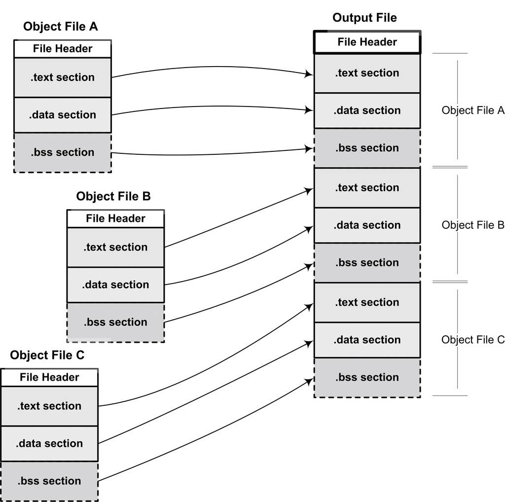
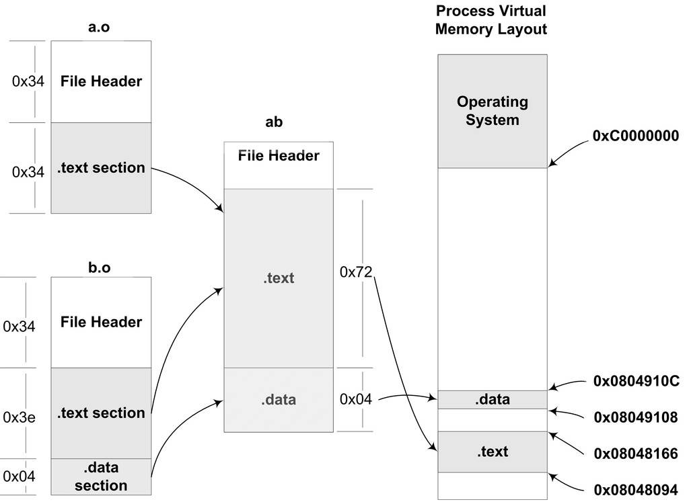

## 4.1 空间与地址分配

对于链接器来说，整个链接过程中，它就是将几个输入目标文件加工后合并成一个输出文件。那么在这个例子里，我们的输入就是目标文件"a.o"和"b.o"，输出就是可执行文件"ab"。我们在前面详细分析了ELF文件的格式，我们知道，可执行文件中的代码段和数据段都是由输入的目标文件中合并而来的。那么我们链接过程就很明显产生了第一个问题：对于多个输入目标文件，链接器如何将它们的各个段合并到输出文件？或者说，输出文件中的空间如何分配给输入文件？

### 4.1.1 按序叠加

一个最简单的方案就是将输入的目标文件按照次序叠加起来，如图4-1所示。

\
图4-1 简单的空间分配策略

图4-1中的做法的确很简单，就是直接将各个目标文件依次合并。但是这样做会造成一个问题，在有很多输入文件的情况下，输出文件将会有很多零散的段。比如一个规模稍大的应用程序可能会有数百个目标文件，如果每个目标文件都分别有.text段、.data段和.bss段，那最后的输出文件将会有成百上千个零散的段。这种做法非常浪费空间，因为每个段都须要有一定的地址和空间对齐要求，比如对于x86的硬件来说，段的装载地址和空间的对齐单位是页，也就是4
096字节（关于地址和空间对齐，我们在后面还会有专门的章节详细介绍）。那么就是说如果一个段的长度只有1个字节，它也要在内存中占用4
096字节。这样会造成内存空间大量的内部碎片，所以这并不是一个很好的方案。

### 4.1.2 相似段合并

一个更实际的方法是将相同性质的段合并到一起，比如将所有输入文件的".text"合并到输出文件的".text"段，接着是".data"段、".bss"段等，如图4-2所示。

\
图4-2 实际的空间分配策略

正如我们前文所提到的，".bss"段在目标文件和可执行文件中并不占用文件的空间，但是它在装载时占用地址空间。所以链接器在合并各个段的同时，也将".bss"合并，并且分配虚拟空间。从".bss"段的空间分配上我们可以思考一个问题，那就是这里的所谓的"空间分配"到底是什么空间？

"链接器为目标文件分配地址和空间"这句话中的"地址和空间"其实有两个含义：第一个是在输出的可执行文件中的空间；第二个是在装载后的虚拟地址中的虚拟地址空间。对于有实际数据的段，比如".text"和".data"来说，它们在文件中和虚拟地址中都要分配空间，因为它们在这两者中都存在；而对于".bss"这样的段来说，分配空间的意义只局限于虚拟地址空间，因为它在文件中并没有内容。事实上，我们在这里谈到的空间分配只关注于虚拟地址空间的分配，因为这个关系到链接器后面的关于地址计算的步骤，而可执行文件本身的空间分配与链接过程关系并不是很大。

> 关于可执行文件和虚拟地址空间之间的关系请参考第10章"可执行文件的装载与进程"。

现在的链接器空间分配的策略基本上都采用上述方法中的第二种，使用这种方法的链接器一般都采用一种叫两步链接（Two-pass
Linking）的方法。也就是说整个链接过程分两步。

**第一步 空间与地址分配**
扫描所有的输入目标文件，并且获得它们的各个段的长度、属性和位置，并且将输入目标文件中的符号表中所有的符号定义和符号引用收集起来，统一放到一个全局符号表。这一步中，链接器将能够获得所有输入目标文件的段长度，并且将它们合并，计算出输出文件中各个段合并后的长度与位置，并建立映射关系。

**第二步 符号解析与重定位**
使用上面第一步中收集到的所有信息，读取输入文件中段的数据、重定位信息，并且进行符号解析与重定位、调整代码中的地址等。事实上第二步是链接过程的核心，特别是重定位过程。

我们使用ld链接器将"a.o"和"b.o"链接起来：

    $ld a.o b.o -e main -o ab

- -e main 表示将main函数作为程序入口，ld链接器默认的程序入口为_start。
- -o ab 表示链接输出文件名为ab，默认为a.out。

让我们使用objdump来查看链接前后地址的分配情况，代码如清单4-1所示。

清单4-1 链接前后各个段的属性

    $ objdump -h a.o
    ...
    Sections:
    Idx Name          Size    VMA       LMA       File off  Algn
      0 .text       00000034  00000000  00000000  00000034  2**2
                    CONTENTS, ALLOC, LOAD, RELOC, READONLY, CODE
      1 .data       00000000  00000000  00000000  00000068  2**2
                    CONTENTS, ALLOC, LOAD, DATA
      2 .bss        00000000  00000000  00000000  00000068  2**2
                    ALLOC
    ...
    $ objdump -h b.o
    ...
    Sections:
    Idx Name        Size      VMA       LMA       File off  Algn
      0 .text       0000003e  00000000  00000000  00000034  2**2
                    CONTENTS, ALLOC, LOAD, READONLY, CODE
      1 .data       00000004  00000000  00000000  00000074  2**2
                    CONTENTS, ALLOC, LOAD, DATA
      2 .bss        00000000  00000000  00000000  00000078  2**2
                    ALLOC
    ...
    $objdump –h ab
    ...
    Sections:
    Idx Name          Size      VMA       LMA       File off  Algn
      0 .text       00000072  08048094  08048094  00000094  2**2
                      CONTENTS, ALLOC, LOAD, READONLY, CODE
      1 .data       00000004  08049108  08049108  00000108  2**2
                      CONTENTS, ALLOC, LOAD, DATA

> VMA表示Virtual Memory Address，即虚拟地址，LMA表示Load Memory
> Address，即加载地址，正常情况下这两个值应该是一样的，但是在有些嵌入式系统中，特别是在那些程序放在ROM的系统中时，LMA和VMA是不相同的。这里我们只要关注VMA即可。

链接前后的程序中所使用的地址已经是程序在进程中的虚拟地址，即我们关心上面各个段中的VMA（Virtual
Memory Address）和Size，而忽略文件偏移（File
off）。我们可以看到，在链接之前，目标文件中的所有段的VMA都是0，因为虚拟空间还没有被分配，所以它们默认都为0。等到链接之后，可执行文件"ab"中的各个段都被分配到了相应的虚拟地址。这里的输出程序"ab"中，".text"段被分配到了地址0x08048094，大小为0x72字节；".data"段从地址0x08049108开始，大小为4字节。整个链接过程前后，目标文件各段的分配、程序虚拟地址如图4-3所示。

\
图4-3 目标文件、可执行文件与进程空间

我们在图4-3中忽略了像.comment这种无关紧要的段，只关心代码段和数据段。由于在本例中没有".bss"段，所以我们也将其简化了。从图4-3中可以看到，"a.o"和"b.o"的代码段被先后叠加起来，合并成"ab"的一个.text段，加起来的长度为0x72。所以"ab"的代码段里面肯定包含了main函数和swap函数的指令代码。

那么，为什么链接器要将可执行文件"ab"的".text"分配到0x08048094、将".data"分配0x08049108？而不是从虚拟空间的0地址开始分配呢？这涉及操作系统的进程虚拟地址空间的分配规则，在Linux下，ELF可执行文件默认从地址0x08048000开始分配。关于进程的虚拟地址分配等相关内容我们将在第6章"可执行文件的装载与进程"这一章进行详细的分析。

### 4.1.3 符号地址的确定

我们还是以"a.o"和"b.o"作为例子，来分析这两个步骤中链接器的工作过程。在第一步的扫描和空间分配阶段，链接器按照前面介绍的空间分配方法进行分配，这时候输入文件中的各个段在链接后的虚拟地址就已经确定了，比如".text"段起始地址为0x08048094，".data"段的起始地址为0x08049108。

当前面一步完成之后，链接器开始计算各个符号的虚拟地址。因为各个符号在段内的相对位置是固定的，所以这时候其实"main"、"shared"和"swap"的地址也已经是确定的了，只不过链接器须要给每个符号加上一个偏移量，使它们能够调整到正确的虚拟地址。比如我们假设"a.o"中的"main"函数相对于"a.o"的".text"段的偏移是X，但是经过链接合并以后，"a.o"的".text"段位于虚拟地址0x08048094，那么"main"的地址应该是0x08048094 +
X。从前面"objdump"的输出看到，"main"位于"a.o"的".text"段的最开始，也就是偏移为0，所以"main"这个符号在最终的输出文件中的地址应该是0x08048094 +
0，即0x08048094。我们也可以通过完全一样的计算方法得知所有符号的地址，在这个例子里面，只有三个全局符号，所以链接器在更新全局符号表的符号地址以后，各个符号的最终地址如表4-1所示。

\
表4-1
