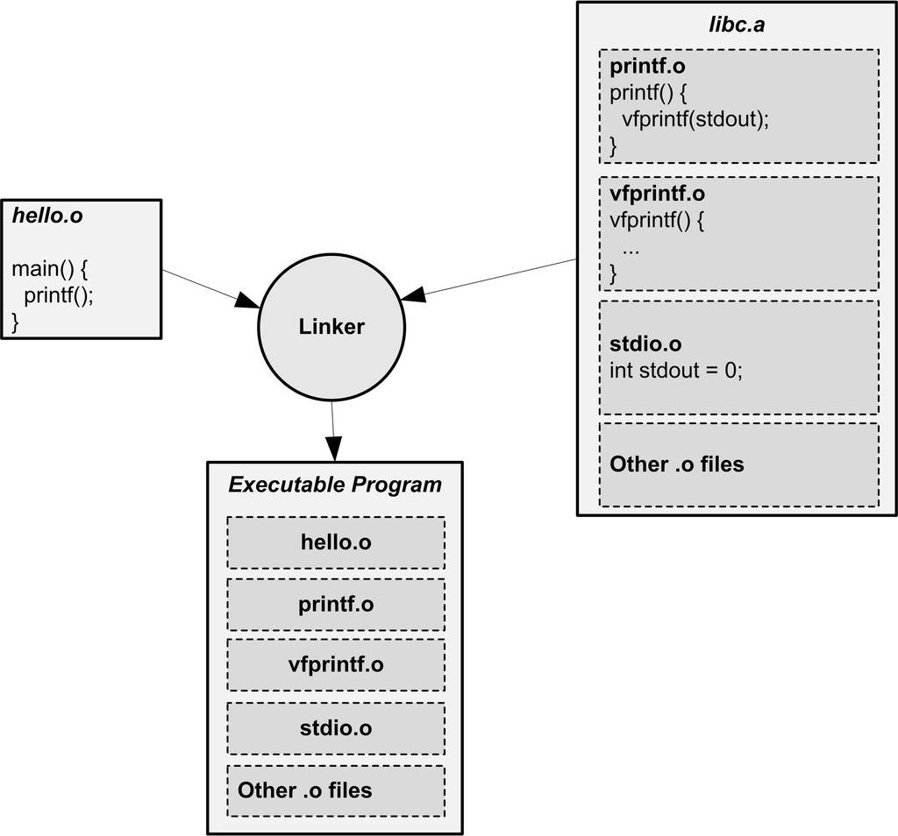

## 4.5 静态库链接

程序之所以有用，因为它会有输入输出，这些输入输出的对象可以是数据，可以是人，也可以是另外一个程序，还可以是另外一台计算机，一个没有输入输出的程序没有任何意义。但是一个程序如何做到输入输出呢？最简单的办法是使用操作系统提供的应用程序编程接口（API,
Application Programming
Interface）。当然，操作系统也只是一个程序，它怎么实现跟人机交互设备、跟其他计算机以及其他程序交互呢？这一点我们在第1章介绍操作系统和I/O时已经简单介绍过了。

让我们还是先回到一个比较初步的问题，就是程序如何使用操作系统提供的API。在一般的情况下，一种语言的开发环境往往会附带有语言库（Language
Library）。这些库就是对操作系统的API的包装，比如我们经典的C语言版"Hello
World"程序，它使用C语言标准库的"printf"函数来输出一个字符串，"printf"函数对字符串进行一些必要的处理以后，最后会调用操作系统提供的API。各个操作系统下，往终端输出字符串的API都不一样，在Linux下，它是一个"write"的系统调用，而在Windows下它是"WriteConsole"系统API。

库里面还带有那些很常用的函数，比如C语言标准库里面有很常用一个函数取得一个字符串的长度叫strlen()，该函数即遍历整个字符串后返回字符串长度，这个函数并没有调用任何操作系统的API，也没有做任何输入输出。但是很大一部分库函数都是要调用操作系统的API的，比如最常用的往终端输出格式化字符串的printf就是会调用操作系统，往终端里面打印一些字符串。我们将在第4部分更加详细地介绍库的概念。这里我们只是简单地介绍静态库的链接过程。

其实一个静态库可以简单地看成一组目标文件的集合，即很多目标文件经过压缩打包后形成的一个文件。比如我们在Linux中最常用的C语言静态库libc位于/usr/lib/libc.a，它属于glibc项目的一部分；像Windows这样的平台上，最常使用的C语言库是由集成开发环境所附带的运行库，这些库一般由编译器厂商提供，比如Visual
C++附带了多个版本的C/C++运行库。表4-3列出了VC2008（内部版本号VC9）所附带的一部分C运行库（库文件存放在VC安装目录下的lib\\目录）。

\
表4-3

表4-3中只是简单列举了几种C语言运行库，我们在这里将介绍一个程序的目标文件如何与C语言运行库链接形成一个可执行文件。关于库的更详细内容，将在第4部分展开讨论。

我们知道在一个C语言的运行库中，包含了很多跟系统功能相关的代码，比如输入输出、文件操作、时间日期、内存管理等。glibc本身是用C语言开发的，它由成百上千个C语言源代码文件组成，也就是说，编译完成以后有相同数量的目标文件，比如输入输出有printf.o，scanf.o；文件操作有fread.o，fwrite.o；时间日期有date.o，time.o；内存管理有malloc.o等。把这些零散的目标文件直接提供给库的使用者，很大程度上会造成文件传输、管理和组织方面的不便，于是通常人们使用"ar"压缩程序将这些目标文件压缩到一起，并且对其进行编号和索引，以便于查找和检索，就形成了libc.a这个静态库文件。在我的机器上，该文件有2.8
MB大小，我们也可以使用"ar"工具来查看这个文件包含了哪些目标文件：

    $ar -t libc.a
    init-first.o
    libc-start.o
    sysdep.o
    version.o
    check_fds.o
    libc-tls.o
    elf-init.o
    dso_handle.o
    errno.o
    errno-loc.o
    iconv_open.o
    iconv.o
    iconv_close.o
    gconv_open.o
    gconv.o
    gconv_close.o
    gconv_db.o
    gconv_conf.o
    ...

> **提示**
>
> Visual
> C++也提供了与Linux下的ar类似的工具，叫lib.exe，这个程序可以用来创建、提取、列举.lib文件中的内容。使用"lib
> /LIST libcmt.lib"就可以列举出libcmt.lib中所有的目标文件。Visual C++
> libcmt.lib中包含949个目标文件。具体参数请参照MSDN。

libc.a里面总共包含了1
400个目标文件，那么，我们如何在这么多目标文件中找到"printf"函数所在的目标文件呢？答案是使用"objdump"或"readelf"加上文本查找工具如"grep"，使用"objdump"查看libc.a的符号可以发现如下结果：

    $objdump -t libc.a
    ...
    printf.o:     file format elf32-i386

    SYMBOL TABLE:
    00000000 l  d .text  00000000 .text
    00000000 l  d .data  00000000 .data
    00000000 l  d   .bss   00000000 .bss
    00000000 l  d .comment   00000000 .comment
    00000000 l    d .note.GNU-stack    00000000 .note.GNU-stack
    00000000 g  F .text  00000026 __printf
    00000000        *UND*  00000000 stdout
    00000000        *UND*  00000000 vfprintf
    00000000 g  F .text  00000026 printf
    00000000 g  F .text  00000026 _IO_printf
    ...

可以看到"printf"函数被定义在了"printf.o"这个目标文件中。这里我们似乎找到了最终的机制，那就是"Hello
World"程序编译出来的目标文件只要和libc.a里面的"printf.o"链接在一起，最后就可以形成一个可用的可执行文件了。这个解释似乎很完美，实际上已经很接近最后的答案了。那么我们就按照这个方案去尝试一下，假设"Hello
World"程序的源代码为"hello.c"，使用如下方法编译：

    $gcc -c -fno-builtin hello.c

我们得到了目标文件为"hello.o"，为什么这里要使用"-fno-builtin"参数是因为默认情况下，GCC会自作聪明地将"Hello
World"程序中只使用了一个字符串参数的"printf"替换成"puts"函数，以提高运行速度，我们要使用"-fno-builtin"关闭这个内置函数优化选项。现在我们还缺"printf.o"，通过"ar"工具解压出"printf.o"：

    $ar -x libc.a

这个命令会将libc.a中的所有目标文件"解压"至当前目录。我们也可以找到"printf.o"，然后将其与"hello.o"链接在一起：

    $ld hello.o printf.o
    ld: warning: cannot find entry symbol _start; defaulting to 0000000008048080
    printf.o: In function `_IO_printf':
    (.text+0x18): undefined reference to `stdout'
    printf.o: In function `_IO_printf':
    (.text+0x20): undefined reference to `vfprintf'

链接却失败了，原因是缺少两个外部符号的定义。其实眼尖的读者可能已经在最开始打印"printf.o"的符号表时就看出一点问题来了，那就是"printf.o"里面有两个"UND"的符号"stdout"和"vfprintf"，也就是有两个未定义的符号。正是这两个未定义的符号打破了看似完美的解释，很明显："printf.o"依赖于其他的目标文件。

用同样的方法，我们可以找到"stdout"这个符号所在的目标文件，它位于"stdio.o"；而"vfprintf"位于"vfprintf.o"。很不幸的是这两个文件还依赖于其他的目标文件，因为它们也有未定义的符号。这些变量和函数都分布在glibc的各个目标文件之中，如果我们能够一一将它们收集齐，那么理论上就可以将它们链接在一起，最后跟"hello.o"链接成一个可执行文件。但是，如果靠人工这样做的代价实在是太大了，我们在这里不打算演示这样一个繁琐的过程。幸好ld链接器会处理这一切繁琐的事务，自动寻找所有须要的符号及它们所在的目标文件，将这些目标文件从"libc.a"中"解压"出来，最终将它们链接在一起成为一个可执行文件。那么我们可不可以就这么认为：将"hello.o"和"libc.a"链接起来就可以得到可执行文件呢？理论上这样就可以了，如图4-6所示。

\
图4-6 静态库链接

实际情况恐怕还是令人失望的，现在Linux系统上的库比我们想象的要复杂。当我们编译和链接一个普通C程序的时候，不仅要用到C语言库libc.a，而且还有其他一些辅助性质的目标文件和库。我们可以使用下面的GCC命令编译"hello.c"，"-verbose"表示将整个编译链接过程的中间步骤打印出来：

    $gcc -static --verbose -fno-builtin hello.c
    Using built-in specs.
    Target: i486-linux-gnu
    Configured with: ../src/configure -v --enable-languages=c,c++,fortran,objc,obj-c++,treelang --prefix=/usr --enable-shared --with-system-zlib --libexecdir=/usr/lib --without-included-gettext --enable-threads=posix --enable-nls --with-gxx-include-dir=/usr/include/c++/4.1.3 --program-suffix=-4.1 --enable-__cxa_atexit --enable-clocale=gnu --enable-libstdcxx-debug --enable-mpfr --enable-checking=release i486-linux-gnu
    Thread model: posix
    gcc version 4.1.3 20070929 (prerelease) (Ubuntu 4.1.2-16ubuntu2)
     /usr/lib/gcc/i486-linux-gnu/4.1.3/cc1 -quiet -v hello.c -quiet -dumpbase hello.c -mtune=generic -auxbase hello -version -fno-builtin -fstack-protector -fstack-protector -o /tmp/ccUhtGSB.s
    ignoring nonexistent directory "/usr/local/include/i486-linux-gnu"
    ignoring nonexistent directory "/usr/lib/gcc/i486-linux-gnu/4.1.3/../../../../i486-linux-gnu/include"
    ignoring nonexistent directory "/usr/include/i486-linux-gnu"
    #include "..." search starts here:
    #include <...> search starts here:
     /usr/local/include
     /usr/lib/gcc/i486-linux-gnu/4.1.3/include
     /usr/include
    End of search list.
    GNU C version 4.1.3 20070929 (prerelease) (Ubuntu 4.1.2-16ubuntu2) (i486-linux-gnu)
            compiled by GNU C version 4.1.3 20070929 (prerelease) (Ubuntu 4.1.2-16ubuntu2).
    GGC heuristics: --param ggc-min-expand=64 --param ggc-min-heapsize=64493
    Compiler executable checksum: caf034d6752b947185f431aa3e927159
     as --traditional-format -V -Qy -o /tmp/ccQZRPL5.o /tmp/ccUhtGSB.s
    GNU assembler version 2.18 (i486-linux-gnu) using BFD version (GNU Binutils for Ubuntu) 2.18
     /usr/lib/gcc/i486-linux-gnu/4.1.3/collect2 -m elf_i386 --hash-style=both -static /usr/lib/gcc/i486-linux-gnu/4.1.3/../../../../lib/crt1.o /usr/lib/gcc/i486-linux-gnu/4.1.3/../../../../lib/crti.o /usr/lib/gcc/i486-linux-gnu/4.1.3/crtbeginT.o -L/usr/lib/gcc/i486-linux-gnu/4.1.3 -L/usr/lib/gcc/i486-linux-gnu/4.1.3 -L/usr/lib/gcc/i486-linux-gnu/4.1.3/../../../../lib -L/lib/../lib -L/usr/lib/../lib /tmp/ccQZRPL5.o --start-group -lgcc -lgcc_eh -lc --end-group /usr/lib/gcc/i486-linux-gnu/4.1.3/crtend.o /usr/lib/gcc/i486-linux-gnu/4.1.3/../../../../lib/crtn.o

关键的三个步骤上面已经用粗体表示出来了，第一步是调用cc1程序，这个程序实际上就是GCC的C语言编译器，它将"hello.c"编译成一个临时的汇编文件"/tmp/ccUhtGSB.s"；然后调用as程序，as程序是GNU的汇编器，它将"/tmp/ccUhtGSB.s"汇编成临时目标文件"/tmp/ccQZRPL5.o"，这个"/tmp/ccQZRPL5.o"实际上就是前面的"hello.o"；接着最关键的步骤是最后一步，GCC调用collect2程序来完成最后的链接。但是按照我们之前的理解，链接过程应该由ld链接器来完成，这里怎么忽然杀出个collect2？这是个什么程序？

实际上collect2可以看作是ld链接器的一个包装，它会调用ld链接器来完成对目标文件的链接，然后再对链接结果进行一些处理，主要是收集所有与程序初始化相关的信息并且构造初始化的结构。在第4部分我们会介绍程序的初始化结构的相关内容，还会再介绍collect2程序。在这里，可以简单地把collect2看作是ld链接器。可以看到最后一步中，至少有下列几个库和目标文件被链接入了最终可执行文件：

- crt1.o
- crti.o
- crtbeginT.o
- libgcc.a
- libgcc_eh.a
- libc.a
- crtend.a
- crtn.a

这些库和目标文件现在看来可能很不熟悉，我们将在第4部分专门介绍这些库及它们背后的原理。

> **Q&A**
>
> **Q：**为什么静态运行库里面一个目标文件只包含一个函数？比如libc.a里面printf.o只有printf()函数、strlen.o只有strlen()函数，为什么要这样组织？
>
> **A：**我们知道，链接器在链接静态库的时候是以目标文件为单位的。比如我们引用了静态库中的printf()函数，那么链接器就会把库中包含printf()函数的那个目标文件链接进来，如果很多函数都放在一个目标文件中，很可能很多没用的函数都被一起链接进了输出结果中。由于运行库有成百上千个函数，数量非常庞大，每个函数独立地放在一个目标文件中可以尽量减少空间的浪费，那些没有被用到的目标文件（函数）就不要链接到最终的输出文件中。
